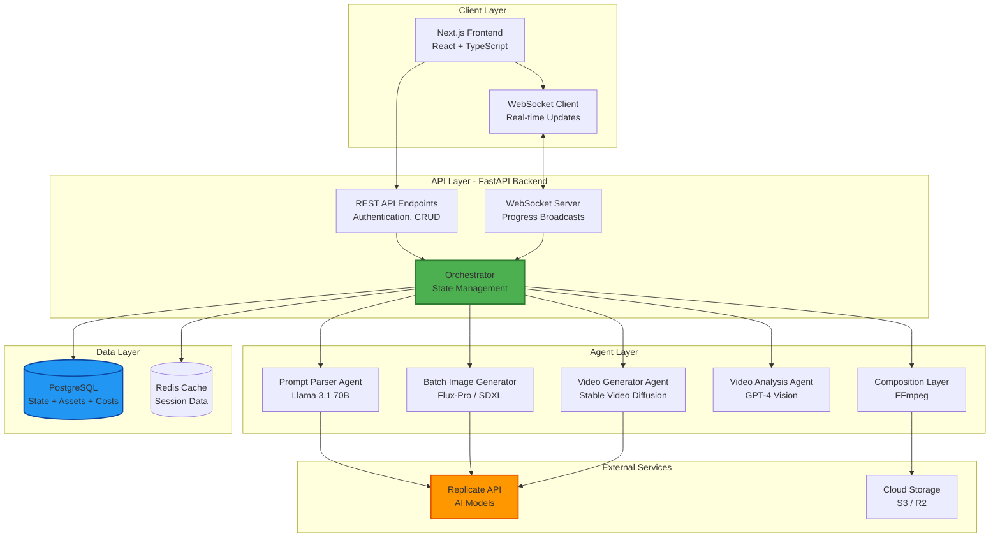

```mermaid
graph TB
    subgraph "Client Layer"
        UI[Next.js Frontend<br/>React + TypeScript]
        WS_CLIENT[WebSocket Client<br/>Real-time Updates]
    end

    subgraph "API Layer - FastAPI Backend"
        API[REST API Endpoints<br/>Authentication, CRUD]
        WS_SERVER[WebSocket Server<br/>Progress Broadcasts]
        ORCHESTRATOR[Orchestrator<br/>State Management]
    end

    subgraph "Agent Layer"
        PARSER[Prompt Parser Agent<br/>Llama 3.1 70B]
        IMG_GEN[Batch Image Generator<br/>Flux-Pro / SDXL]
        VIDEO_GEN[Video Generator Agent<br/>Stable Video Diffusion]
        VIDEO_ANALYSIS[Video Analysis Agent<br/>GPT-4 Vision]
        COMPOSITOR[Composition Layer<br/>FFmpeg]
    end

    subgraph "External Services"
        REPLICATE[Replicate API<br/>AI Models]
        STORAGE[Cloud Storage<br/>S3 / R2]
    end

    subgraph "Data Layer"
        DB[(PostgreSQL<br/>State + Assets + Costs)]
        CACHE[(Redis Cache<br/>Session Data)]
    end

    UI --> API
    UI --> WS_CLIENT
    WS_CLIENT <--> WS_SERVER
    API --> ORCHESTRATOR
    WS_SERVER --> ORCHESTRATOR

    ORCHESTRATOR --> PARSER
    ORCHESTRATOR --> IMG_GEN
    ORCHESTRATOR --> VIDEO_GEN
    ORCHESTRATOR --> VIDEO_ANALYSIS
    ORCHESTRATOR --> COMPOSITOR

    PARSER --> REPLICATE
    IMG_GEN --> REPLICATE
    VIDEO_GEN --> REPLICATE
    COMPOSITOR --> STORAGE

    ORCHESTRATOR --> DB
    ORCHESTRATOR --> CACHE

    style ORCHESTRATOR fill:#4CAF50,stroke:#2E7D32,stroke-width:3px
    style REPLICATE fill:#FF9800,stroke:#E65100,stroke-width:2px
    style DB fill:#2196F3,stroke:#0D47A1,stroke-width:2px
```
