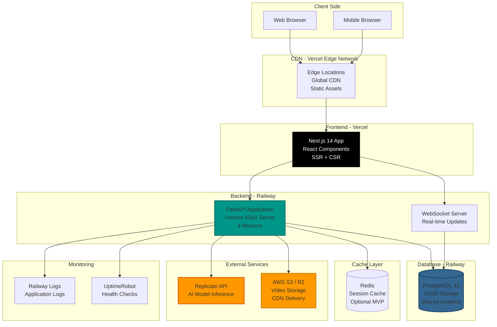

```mermaid
graph TB
    subgraph "Client Side"
        BROWSER[Web Browser]
        MOBILE[Mobile Browser]
    end

    subgraph "CDN - Vercel Edge Network"
        EDGE[Edge Locations<br/>Global CDN<br/>Static Assets]
    end

    subgraph "Frontend - Vercel"
        NEXTJS[Next.js 14 App<br/>React Components<br/>SSR + CSR]
    end

    subgraph "Backend - Railway"
        FASTAPI[FastAPI Application<br/>Uvicorn ASGI Server<br/>4 Workers]
        WS_SERVER[WebSocket Server<br/>Real-time Updates]
    end

    subgraph "Database - Railway"
        POSTGRES[(PostgreSQL 15<br/>10GB Storage<br/>Shared Instance)]
    end

    subgraph "Cache Layer"
        REDIS[(Redis<br/>Session Cache<br/>Optional MVP)]
    end

    subgraph "External Services"
        REPLICATE_API[Replicate API<br/>AI Model Inference]
        S3[AWS S3 / R2<br/>Video Storage<br/>CDN Delivery]
    end

    subgraph "Monitoring"
        LOGS[Railway Logs<br/>Application Logs]
        UPTIME[UptimeRobot<br/>Health Checks]
    end

    BROWSER --> EDGE
    MOBILE --> EDGE
    EDGE --> NEXTJS

    NEXTJS --> FASTAPI
    NEXTJS --> WS_SERVER

    FASTAPI --> POSTGRES
    FASTAPI --> REDIS
    FASTAPI --> REPLICATE_API
    FASTAPI --> S3

    WS_SERVER --> POSTGRES

    FASTAPI --> LOGS
    FASTAPI --> UPTIME

    style NEXTJS fill:#000000,stroke:#000000,stroke-width:2px,color:#FFFFFF
    style FASTAPI fill:#009688,stroke:#00695C,stroke-width:2px
    style POSTGRES fill:#336791,stroke:#1A3D5C,stroke-width:2px
    style REPLICATE_API fill:#FF9800,stroke:#E65100,stroke-width:2px
    style S3 fill:#FF9900,stroke:#CC7A00,stroke-width:2px
```
