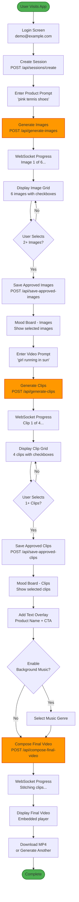

```mermaid
graph TD
    START([User Visits App]) --> LOGIN[Login Screen<br/>demo@example.com]
    LOGIN --> CREATE_SESSION[Create Session<br/>POST /api/sessions/create]

    CREATE_SESSION --> PRODUCT_PROMPT[Enter Product Prompt<br/>'pink tennis shoes']
    PRODUCT_PROMPT --> GEN_IMAGES[Generate Images<br/>POST /api/generate-images]

    GEN_IMAGES --> WS_PROGRESS1[WebSocket Progress<br/>Image 1 of 6...]
    WS_PROGRESS1 --> DISPLAY_IMAGES[Display Image Grid<br/>6 images with checkboxes]

    DISPLAY_IMAGES --> SELECT_IMAGES{User Selects<br/>2+ Images?}
    SELECT_IMAGES -->|No| DISPLAY_IMAGES
    SELECT_IMAGES -->|Yes| SAVE_IMAGES[Save Approved Images<br/>POST /api/save-approved-images]

    SAVE_IMAGES --> MOOD_BOARD1[Mood Board - Images<br/>Show selected images]
    MOOD_BOARD1 --> VIDEO_PROMPT[Enter Video Prompt<br/>'girl running in sun']

    VIDEO_PROMPT --> GEN_CLIPS[Generate Clips<br/>POST /api/generate-clips]
    GEN_CLIPS --> WS_PROGRESS2[WebSocket Progress<br/>Clip 1 of 4...]
    WS_PROGRESS2 --> DISPLAY_CLIPS[Display Clip Grid<br/>4 clips with checkboxes]

    DISPLAY_CLIPS --> SELECT_CLIPS{User Selects<br/>1+ Clips?}
    SELECT_CLIPS -->|No| DISPLAY_CLIPS
    SELECT_CLIPS -->|Yes| SAVE_CLIPS[Save Approved Clips<br/>POST /api/save-approved-clips]

    SAVE_CLIPS --> MOOD_BOARD2[Mood Board - Clips<br/>Show selected clips]
    MOOD_BOARD2 --> TEXT_OVERLAY[Add Text Overlay<br/>Product Name + CTA]

    TEXT_OVERLAY --> AUDIO_SELECT{Enable<br/>Background Music?}
    AUDIO_SELECT -->|Yes| AUDIO_CONFIG[Select Music Genre]
    AUDIO_SELECT -->|No| COMPOSE
    AUDIO_CONFIG --> COMPOSE[Compose Final Video<br/>POST /api/compose-final-video]

    COMPOSE --> WS_PROGRESS3[WebSocket Progress<br/>Stitching clips...]
    WS_PROGRESS3 --> FINAL_VIDEO[Display Final Video<br/>Embedded player]

    FINAL_VIDEO --> DOWNLOAD[Download MP4<br/>or Generate Another]
    DOWNLOAD --> END([Complete])

    style START fill:#4CAF50,stroke:#2E7D32,stroke-width:2px
    style END fill:#4CAF50,stroke:#2E7D32,stroke-width:2px
    style GEN_IMAGES fill:#FF9800,stroke:#E65100,stroke-width:2px
    style GEN_CLIPS fill:#FF9800,stroke:#E65100,stroke-width:2px
    style COMPOSE fill:#FF9800,stroke:#E65100,stroke-width:2px
```
