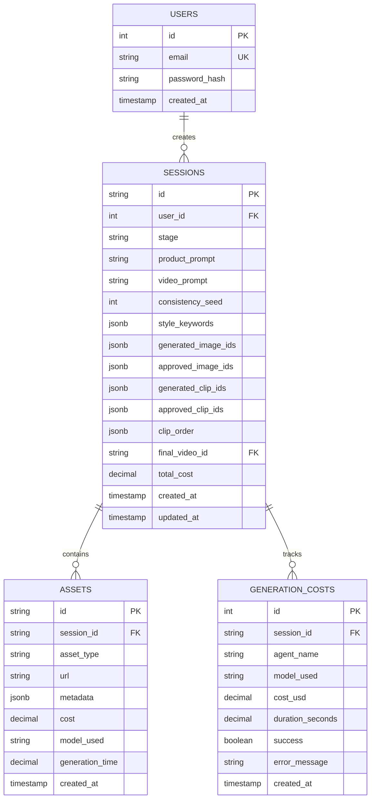

```mermaid
erDiagram
    USERS ||--o{ SESSIONS : creates
    SESSIONS ||--o{ ASSETS : contains
    SESSIONS ||--o{ GENERATION_COSTS : tracks

    USERS {
        int id PK
        string email UK
        string password_hash
        timestamp created_at
    }

    SESSIONS {
        string id PK
        int user_id FK
        string stage
        string product_prompt
        string video_prompt
        int consistency_seed
        jsonb style_keywords
        jsonb generated_image_ids
        jsonb approved_image_ids
        jsonb generated_clip_ids
        jsonb approved_clip_ids
        jsonb clip_order
        string final_video_id FK
        decimal total_cost
        timestamp created_at
        timestamp updated_at
    }

    ASSETS {
        string id PK
        string session_id FK
        string asset_type
        string url
        jsonb metadata
        decimal cost
        string model_used
        decimal generation_time
        timestamp created_at
    }

    GENERATION_COSTS {
        int id PK
        string session_id FK
        string agent_name
        string model_used
        decimal cost_usd
        decimal duration_seconds
        boolean success
        string error_message
        timestamp created_at
    }
```
