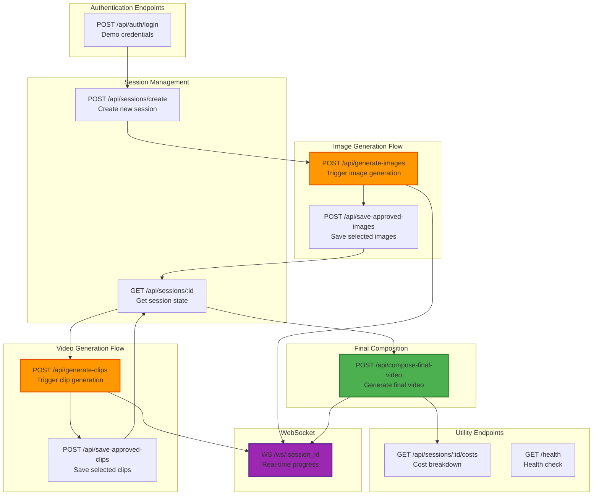

```mermaid
graph TB
    subgraph "Authentication Endpoints"
        AUTH_LOGIN[POST /api/auth/login<br/>Demo credentials]
    end

    subgraph "Session Management"
        SESSION_CREATE[POST /api/sessions/create<br/>Create new session]
        SESSION_GET[GET /api/sessions/:id<br/>Get session state]
    end

    subgraph "Image Generation Flow"
        IMG_GENERATE[POST /api/generate-images<br/>Trigger image generation]
        IMG_APPROVE[POST /api/save-approved-images<br/>Save selected images]
    end

    subgraph "Video Generation Flow"
        CLIP_GENERATE[POST /api/generate-clips<br/>Trigger clip generation]
        CLIP_APPROVE[POST /api/save-approved-clips<br/>Save selected clips]
    end

    subgraph "Final Composition"
        FINAL_COMPOSE[POST /api/compose-final-video<br/>Generate final video]
    end

    subgraph "Utility Endpoints"
        COSTS_GET[GET /api/sessions/:id/costs<br/>Cost breakdown]
        HEALTH[GET /health<br/>Health check]
    end

    subgraph "WebSocket"
        WS_CONNECT[WS /ws/:session_id<br/>Real-time progress]
    end

    AUTH_LOGIN --> SESSION_CREATE
    SESSION_CREATE --> IMG_GENERATE
    IMG_GENERATE --> WS_CONNECT
    IMG_GENERATE --> IMG_APPROVE
    IMG_APPROVE --> SESSION_GET
    SESSION_GET --> CLIP_GENERATE
    CLIP_GENERATE --> WS_CONNECT
    CLIP_GENERATE --> CLIP_APPROVE
    CLIP_APPROVE --> SESSION_GET
    SESSION_GET --> FINAL_COMPOSE
    FINAL_COMPOSE --> WS_CONNECT
    FINAL_COMPOSE --> COSTS_GET

    style IMG_GENERATE fill:#FF9800,stroke:#E65100,stroke-width:2px
    style CLIP_GENERATE fill:#FF9800,stroke:#E65100,stroke-width:2px
    style FINAL_COMPOSE fill:#4CAF50,stroke:#2E7D32,stroke-width:2px
    style WS_CONNECT fill:#9C27B0,stroke:#4A148C,stroke-width:2px
```
