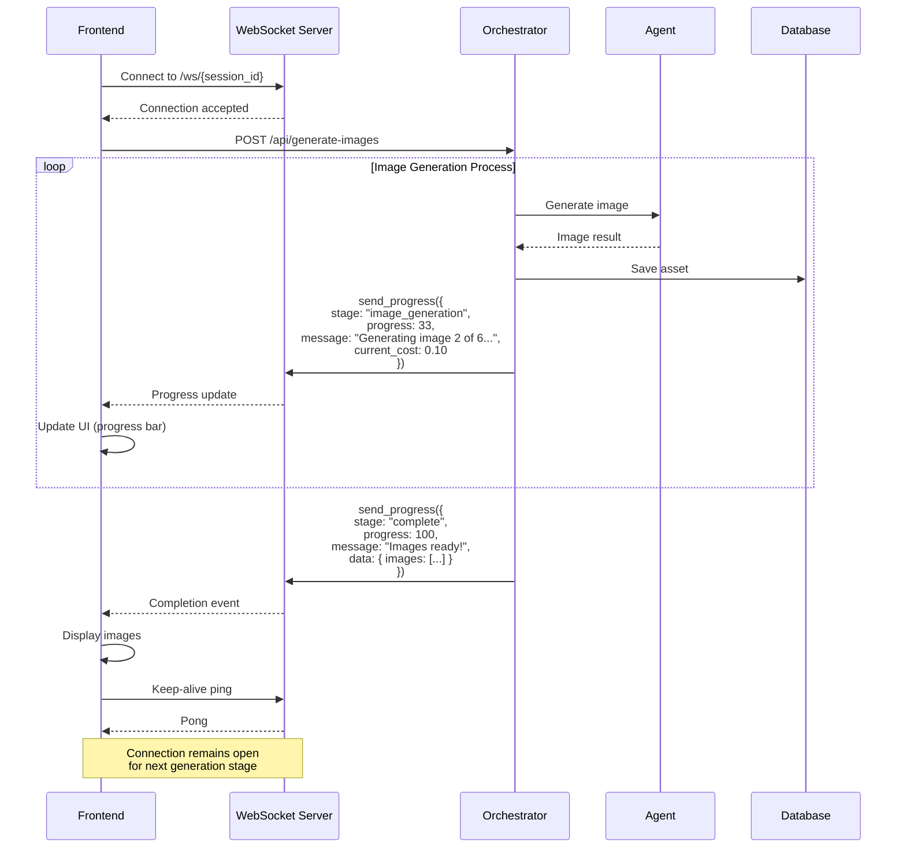

```mermaid
sequenceDiagram
    participant Frontend
    participant WSServer as WebSocket Server
    participant Orchestrator
    participant Agent
    participant Database

    Frontend->>WSServer: Connect to /ws/{session_id}
    WSServer-->>Frontend: Connection accepted

    Frontend->>Orchestrator: POST /api/generate-images

    loop Image Generation Process
        Orchestrator->>Agent: Generate image
        Agent-->>Orchestrator: Image result
        Orchestrator->>Database: Save asset

        Orchestrator->>WSServer: send_progress({<br/>  stage: "image_generation",<br/>  progress: 33,<br/>  message: "Generating image 2 of 6...",<br/>  current_cost: 0.10<br/>})
        WSServer-->>Frontend: Progress update
        Frontend->>Frontend: Update UI (progress bar)
    end

    Orchestrator->>WSServer: send_progress({<br/>  stage: "complete",<br/>  progress: 100,<br/>  message: "Images ready!",<br/>  data: { images: [...] }<br/>})
    WSServer-->>Frontend: Completion event
    Frontend->>Frontend: Display images

    Frontend->>WSServer: Keep-alive ping
    WSServer-->>Frontend: Pong

    Note over Frontend,WSServer: Connection remains open<br/>for next generation stage
```
