# AI Ad Video Generator - Architecture Diagrams

### Version: 2.0

### Date: November 14, 2025

---

## Table of Contents

1. [High-Level System Architecture](#1-high-level-system-architecture)
2. [Multi-Agent Orchestration Flow](#2-multi-agent-orchestration-flow)
3. [Complete User Journey Flow](#3-complete-user-journey-flow)
4. [Data Flow Diagram](#4-data-flow-diagram)
5. [Database Schema Relationships](#5-database-schema-relationships)
6. [API Endpoint Architecture](#6-api-endpoint-architecture)
7. [WebSocket Communication Flow](#7-websocket-communication-flow)
8. [Image Generation Pipeline](#8-image-generation-pipeline)
9. [Video Generation Pipeline](#9-video-generation-pipeline)
10. [Final Composition Pipeline](#10-final-composition-pipeline)
11. [Cost Tracking Architecture](#11-cost-tracking-architecture)
12. [Deployment Architecture](#12-deployment-architecture)

---

## 1. High-Level System Architecture

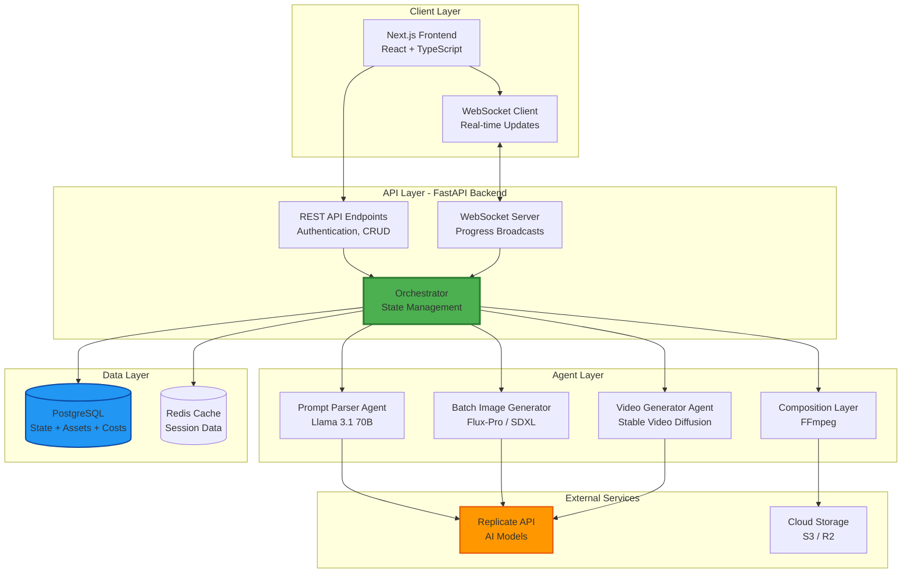

---

## 2. Multi-Agent Orchestration Flow

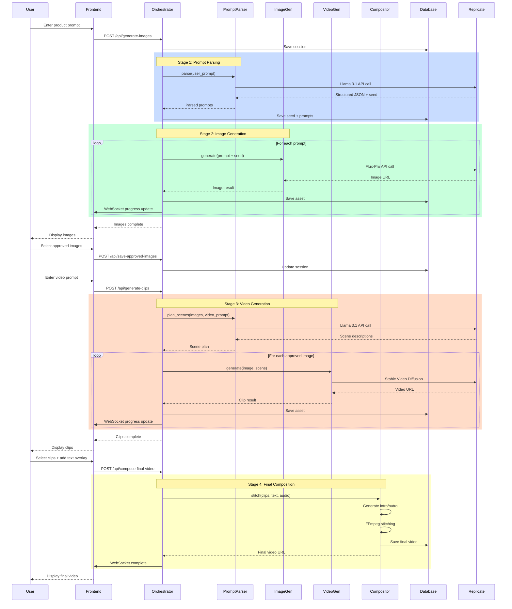

---

## 3. Complete User Journey Flow

```mermaid
graph TD
    START([User Visits App]) --> LOGIN[Login Screen<br/>demo@example.com]
    LOGIN --> CREATE_SESSION[Create Session<br/>POST /api/sessions/create]

    CREATE_SESSION --> PRODUCT_PROMPT[Enter Product Prompt<br/>'pink tennis shoes']
    PRODUCT_PROMPT --> GEN_IMAGES[Generate Images<br/>POST /api/generate-images]

    GEN_IMAGES --> WS_PROGRESS1[WebSocket Progress<br/>Image 1 of 6...]
    WS_PROGRESS1 --> DISPLAY_IMAGES[Display Image Grid<br/>6 images with checkboxes]

    DISPLAY_IMAGES --> SELECT_IMAGES{User Selects<br/>2+ Images?}
    SELECT_IMAGES -->|No| DISPLAY_IMAGES
    SELECT_IMAGES -->|Yes| SAVE_IMAGES[Save Approved Images<br/>POST /api/save-approved-images]

    SAVE_IMAGES --> MOOD_BOARD1[Mood Board - Images<br/>Show selected images]
    MOOD_BOARD1 --> VIDEO_PROMPT[Enter Video Prompt<br/>'girl running in sun']

    VIDEO_PROMPT --> GEN_CLIPS[Generate Clips<br/>POST /api/generate-clips]
    GEN_CLIPS --> WS_PROGRESS2[WebSocket Progress<br/>Clip 1 of 4...]
    WS_PROGRESS2 --> DISPLAY_CLIPS[Display Clip Grid<br/>4 clips with checkboxes]

    DISPLAY_CLIPS --> SELECT_CLIPS{User Selects<br/>1+ Clips?}
    SELECT_CLIPS -->|No| DISPLAY_CLIPS
    SELECT_CLIPS -->|Yes| SAVE_CLIPS[Save Approved Clips<br/>POST /api/save-approved-clips]

    SAVE_CLIPS --> MOOD_BOARD2[Mood Board - Clips<br/>Show selected clips]
    MOOD_BOARD2 --> TEXT_OVERLAY[Add Text Overlay<br/>Product Name + CTA]

    TEXT_OVERLAY --> AUDIO_SELECT{Enable<br/>Background Music?}
    AUDIO_SELECT -->|Yes| AUDIO_CONFIG[Select Music Genre]
    AUDIO_SELECT -->|No| COMPOSE
    AUDIO_CONFIG --> COMPOSE[Compose Final Video<br/>POST /api/compose-final-video]

    COMPOSE --> WS_PROGRESS3[WebSocket Progress<br/>Stitching clips...]
    WS_PROGRESS3 --> FINAL_VIDEO[Display Final Video<br/>Embedded player]

    FINAL_VIDEO --> DOWNLOAD[Download MP4<br/>or Generate Another]
    DOWNLOAD --> END([Complete])

    style START fill:#4CAF50,stroke:#2E7D32,stroke-width:2px
    style END fill:#4CAF50,stroke:#2E7D32,stroke-width:2px
    style GEN_IMAGES fill:#FF9800,stroke:#E65100,stroke-width:2px
    style GEN_CLIPS fill:#FF9800,stroke:#E65100,stroke-width:2px
    style COMPOSE fill:#FF9800,stroke:#E65100,stroke-width:2px
```

---

## 4. Data Flow Diagram

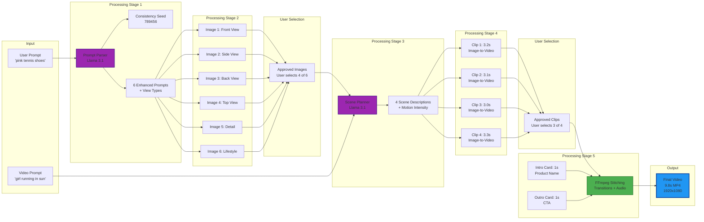

---

## 5. Database Schema Relationships

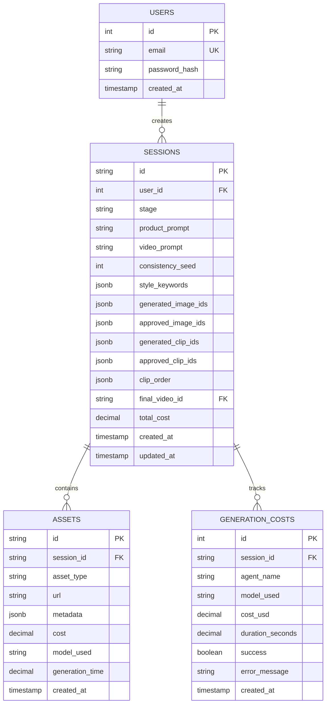

---

## 6. API Endpoint Architecture

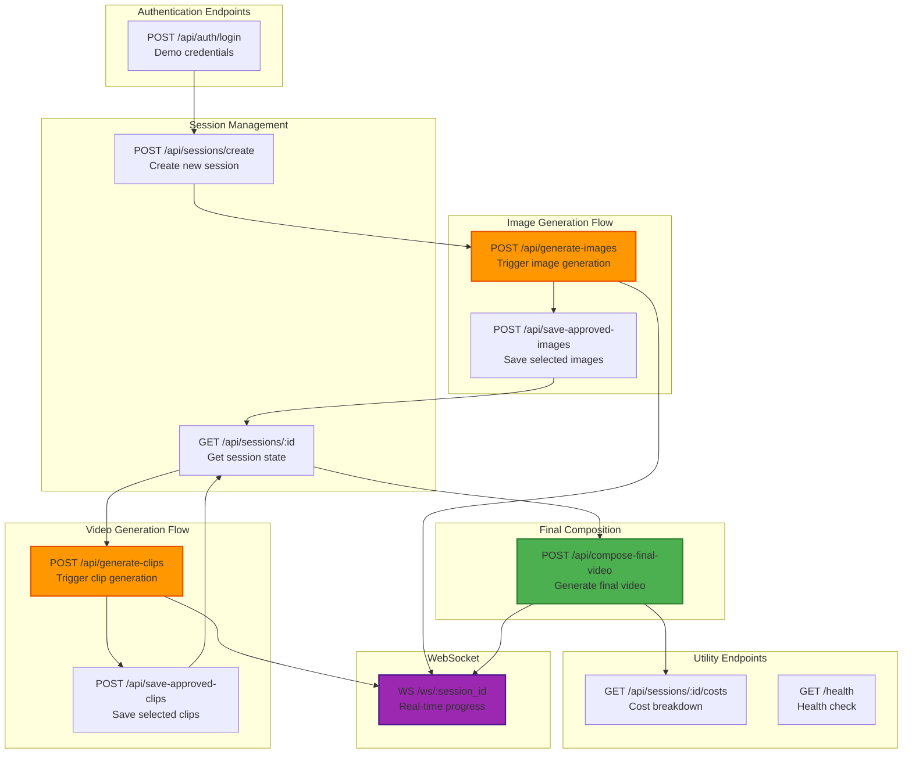

---

## 7. WebSocket Communication Flow

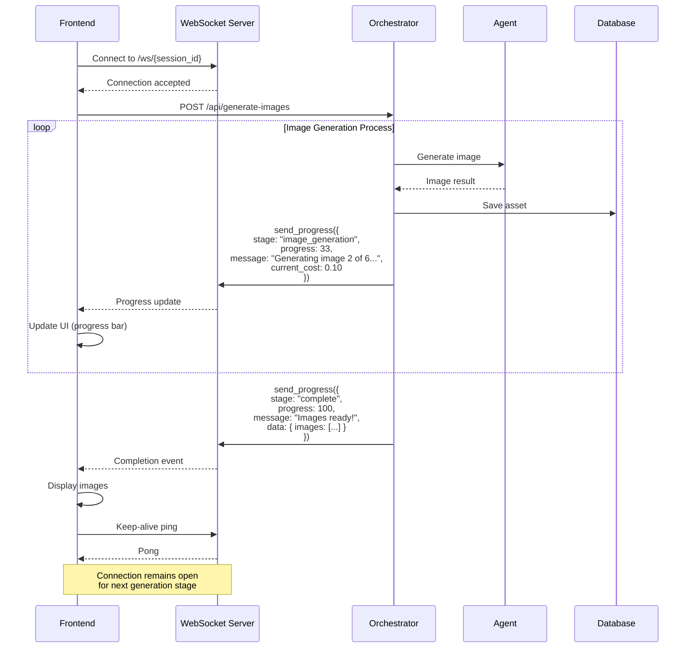

---

## 8. Image Generation Pipeline

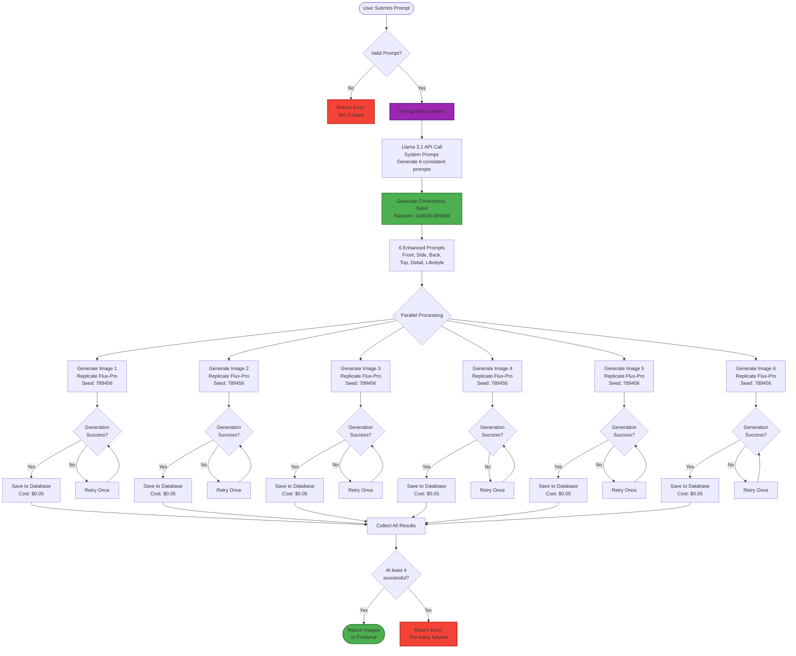

---

## 9. Video Generation Pipeline

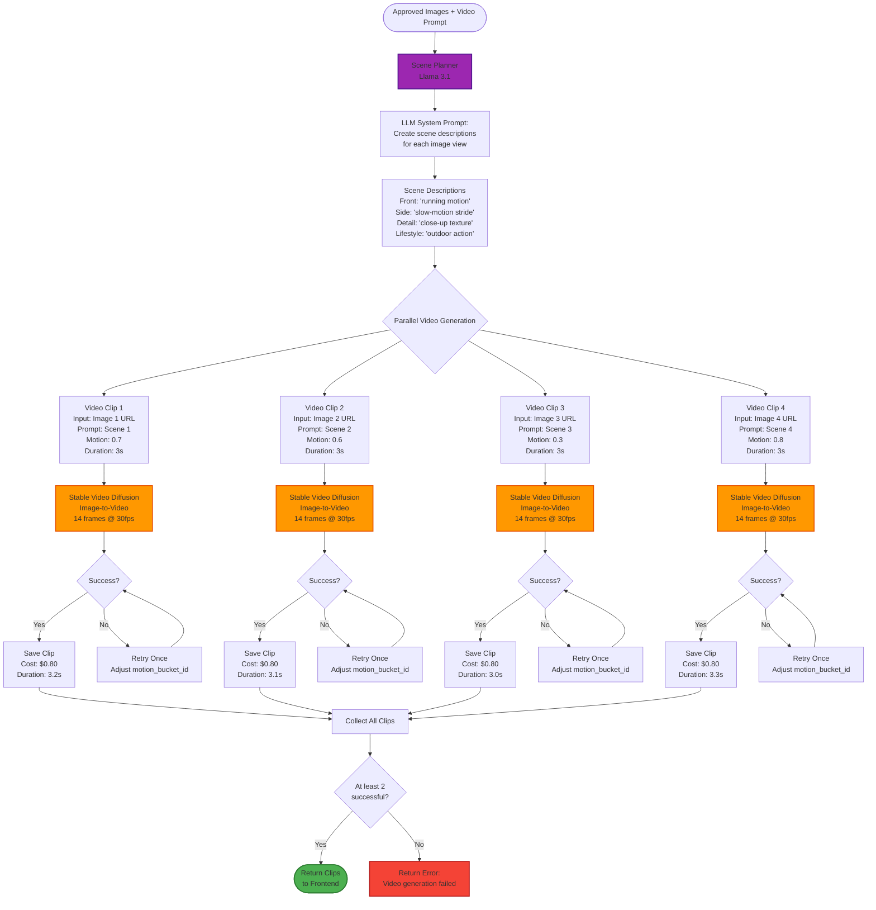

---

## 10. Final Composition Pipeline

```mermaid
flowchart TD
    START([Approved Clips + Text Overlay + Audio Config]) --> DOWNLOAD[Download All Clips<br/>to Temp Directory]

    DOWNLOAD --> INTRO[Generate Intro Card<br/>FFmpeg: 1s black screen<br/>+ Product Name text]

    INTRO --> OUTRO[Generate Outro Card<br/>FFmpeg: 1s black screen<br/>+ CTA text]

    OUTRO --> AUDIO_CHECK{Background<br/>Music Enabled?}

    AUDIO_CHECK -->|Yes| AUDIO_FETCH[Fetch Background Music<br/>Genre: upbeat<br/>Duration: 10s]
    AUDIO_CHECK -->|No| CONCAT_FILE

    AUDIO_FETCH --> CONCAT_FILE[Create FFmpeg<br/>Concat File<br/>List all clips in order]

    CONCAT_FILE --> FFMPEG[FFmpeg Composition<br/>Complex Filter]

    FFMPEG --> SCALE[Scale to 1920x1080<br/>Maintain aspect ratio<br/>Add padding if needed]

    SCALE --> TEXT_OVERLAY[Add Text Overlays<br/>drawtext filter<br/>Intro: 1-2s<br/>Outro: 9-10s]

    TEXT_OVERLAY --> TRANSITIONS[Add Transitions<br/>Crossfade: 0.5s<br/>between clips]

    TRANSITIONS --> AUDIO_MIX{Audio Track<br/>Exists?}

    AUDIO_MIX -->|Yes| MIX_AUDIO[Mix Audio<br/>Background music<br/>Fade in/out<br/>Volume: 0.7]
    AUDIO_MIX -->|No| ENCODE

    MIX_AUDIO --> ENCODE[Encode Final Video<br/>Codec: H.264<br/>CRF: 23<br/>Preset: medium<br/>AAC Audio: 192k]

    ENCODE --> OPTIMIZE[Web Optimization<br/>+faststart flag<br/>yuv420p pixel format]

    OPTIMIZE --> UPLOAD[Upload to Storage<br/>S3 / Cloudflare R2<br/>Content-Type: video/mp4]

    UPLOAD --> VERIFY{Verify File<br/>Size < 20MB?}

    VERIFY -->|Yes| SAVE_DB[Save to Database<br/>final_video_url<br/>Cost: $0.50]
    VERIFY -->|No| COMPRESS[Re-encode with<br/>higher CRF (25)]

    COMPRESS --> UPLOAD

    SAVE_DB --> SUCCESS([Return Final Video<br/>URL + Metadata])

    style FFMPEG fill:#4CAF50,stroke:#2E7D32,stroke-width:3px
    style ENCODE fill:#2196F3,stroke:#0D47A1,stroke-width:2px
    style SUCCESS fill:#4CAF50,stroke:#2E7D32,stroke-width:2px
```

---

## 11. Cost Tracking Architecture

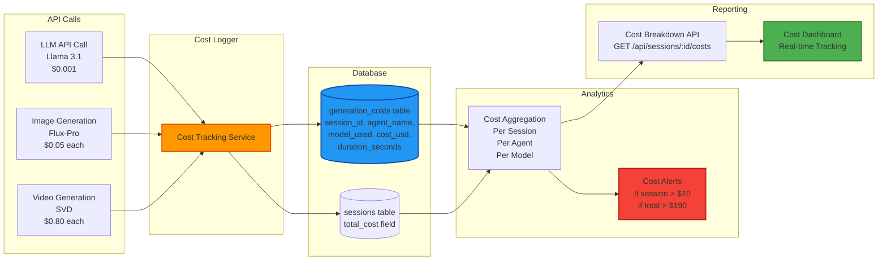

---

## 12. Deployment Architecture

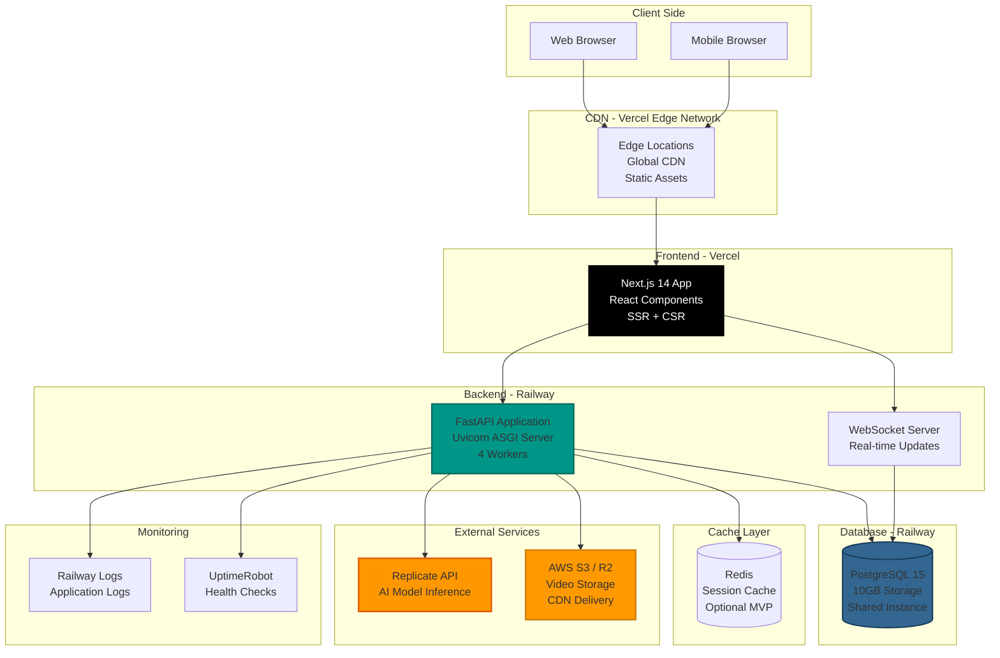

---

## Additional Diagrams

### Agent State Machine

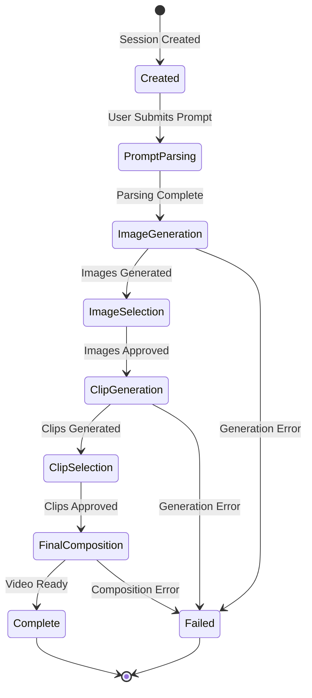

### Error Handling Flow

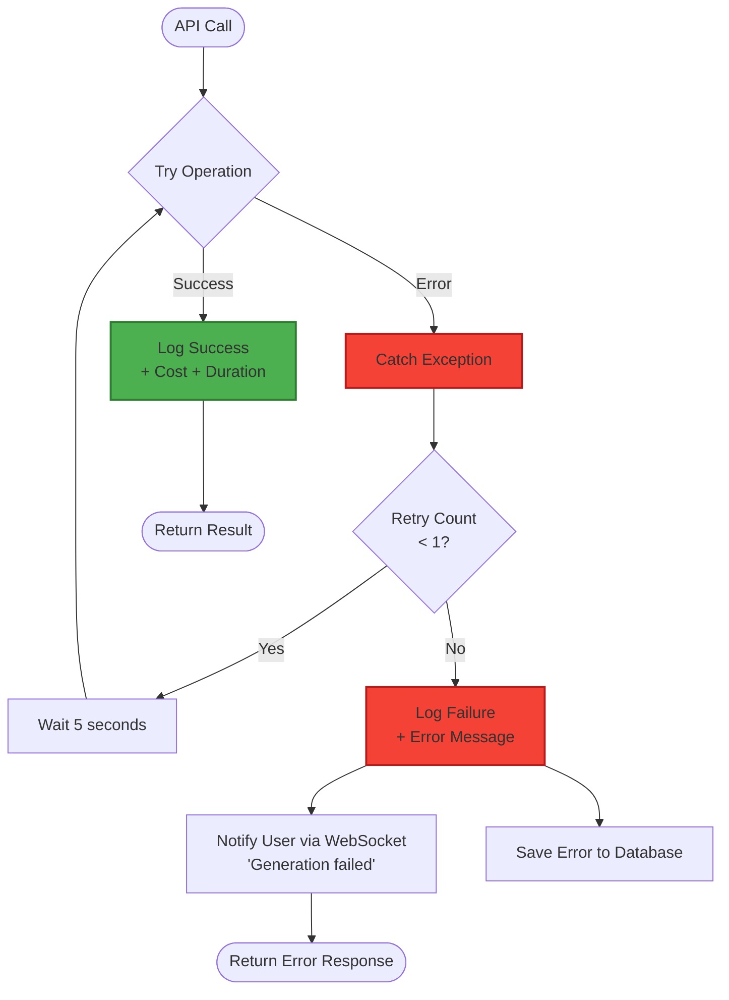

### Session State Lifecycle

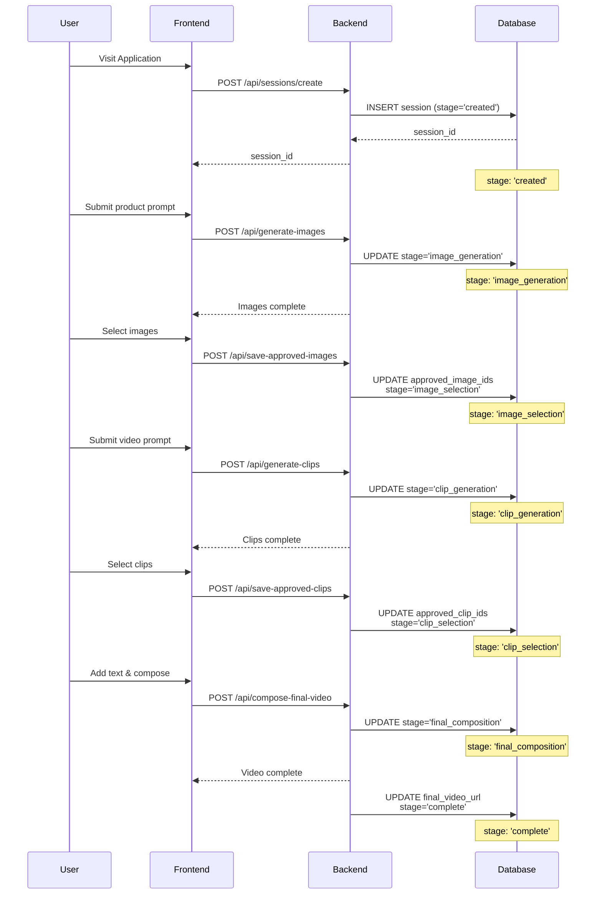

---

## Summary

This architecture document provides comprehensive visual representations of:

1. **System Architecture** - High-level component organization
2. **Agent Orchestration** - Multi-agent coordination patterns
3. **User Journey** - Complete flow from login to download
4. **Data Flow** - Transformation stages through the pipeline
5. **Database Schema** - Relational structure and relationships
6. **API Design** - Endpoint organization and dependencies
7. **WebSocket Communication** - Real-time progress updates
8. **Image Pipeline** - Detailed image generation workflow
9. **Video Pipeline** - Video clip generation process
10. **Composition Pipeline** - Final video assembly
11. **Cost Tracking** - Financial monitoring system
12. **Deployment** - Production infrastructure

All diagrams use Mermaid syntax and can be:

- Rendered in GitHub README files
- Displayed in documentation tools (GitBook, Docusaurus)
- Converted to PNG/SVG using Mermaid CLI
- Embedded in presentations

---

**Document Version:** 2.0  
**Last Updated:** November 14, 2025  
**Compatible with:** PRD v2.0
