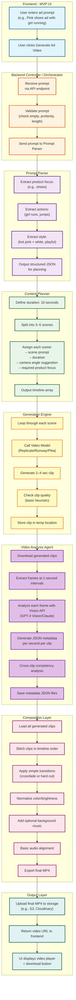

```mermaid
flowchart TD

%% ---------- FRONTEND ----------
subgraph FE["Frontend - MVP UI"]
    A1["User enters ad prompt<br/>(e.g., Pink shoes ad with girl running)"]
    A2["User clicks Generate Ad Video"]
end

%% ---------- BACKEND CONTROLLER ----------
subgraph BE["Backend Controller / Orchestrator"]
    B1["Receive prompt<br/>via API endpoint"]
    B2["Validate prompt<br/>(check empty, profanity, length)"]
    B3["Send prompt to Prompt Parser"]
end

%% ---------- PROMPT PARSER ----------
subgraph PARSER["Prompt Parser"]
    C1["Extract product focus:<br/>(e.g., shoes)"]
    C2["Extract actions:<br/>(girl runs, jumps)"]
    C3["Extract style:<br/>(hot pink + white, playful)"]
    C4["Output structured JSON<br/>for planning"]
end

%% ---------- CONTENT PLANNER ----------
subgraph PLAN["Content Planner"]
    D1["Define duration: 10 seconds"]
    D2["Split into 3–5 scenes"]
    D3["Assign each scene:<br/>– scene prompt<br/>– duration<br/>– camera angle suggestion<br/>– required product focus"]
    D4["Output timeline array"]
end

%% ---------- GENERATION ENGINE ----------
subgraph GEN["Generation Engine"]
    E1["Loop through each scene"]
    E2["Call Video Model<br/>(Replicate/Runway/Pika)"]
    E3["Generate 2–4 sec clip"]
    E4["Check clip quality<br/>(basic heuristic)"]
    E5["Store clip in temp location"]
end

%% ---------- VIDEO ANALYSIS ----------
subgraph ANALYZE["Video Analysis Agent"]
    H1["Download generated clips"]
    H2["Extract frames at 1-second intervals"]
    H3["Analyze each frame with Vision API<br/>(GPT-4 Vision/Claude)"]
    H4["Generate JSON metadata<br/>per second per clip"]
    H5["Cross-clip consistency analysis"]
    H6["Save metadata JSON files"]
end

%% ---------- COMPOSITION LAYER ----------
subgraph COMP["Composition Layer"]
    F1["Load all generated clips"]
    F2["Stitch clips in timeline order"]
    F3["Apply simple transitions<br/>(crossfade or hard cut)"]
    F4["Normalize color/brightness"]
    F5["Add optional background music"]
    F6["Basic audio alignment"]
    F7["Export final MP4"]
end

%% ---------- DEPLOYMENT / OUTPUT ----------
subgraph OUT["Output Layer"]
    G1["Upload final MP4 to storage<br/>(e.g., S3, Cloudinary)"]
    G2["Return video URL to frontend"]
    G3["UI displays video player<br/>+ download button"]
end

%% FLOW CONNECTIONS
A1 --> A2
A2 --> B1
B1 --> B2
B2 --> B3
B3 --> C1
C1 --> C2
C2 --> C3
C3 --> C4
C4 --> D1
D1 --> D2
D2 --> D3
D3 --> D4
D4 --> E1
E1 --> E2
E2 --> E3
E3 --> E4
E4 --> E5
E5 --> H1
H1 --> H2
H2 --> H3
H3 --> H4
H4 --> H5
H5 --> H6
H6 --> F1
F1 --> F2
F2 --> F3
F3 --> F4
F4 --> F5
F5 --> F6
F6 --> F7
F7 --> G1
G1 --> G2
G2 --> G3

%% Styling
classDef frontend fill:#e1f5ff,stroke:#01579b,stroke-width:2px
classDef backend fill:#fff3e0,stroke:#e65100,stroke-width:2px
classDef parser fill:#f3e5f5,stroke:#4a148c,stroke-width:2px
classDef planner fill:#e8f5e9,stroke:#1b5e20,stroke-width:2px
classDef generator fill:#fff9c4,stroke:#f57f17,stroke-width:2px
classDef analyzer fill:#e1bee7,stroke:#6a1b9a,stroke-width:2px
classDef composer fill:#fce4ec,stroke:#880e4f,stroke-width:2px
classDef output fill:#e0f2f1,stroke:#004d40,stroke-width:2px

class A1,A2 frontend
class B1,B2,B3 backend
class C1,C2,C3,C4 parser
class D1,D2,D3,D4 planner
class E1,E2,E3,E4,E5 generator
class H1,H2,H3,H4,H5,H6 analyzer
class F1,F2,F3,F4,F5,F6,F7 composer
class G1,G2,G3 output
```
