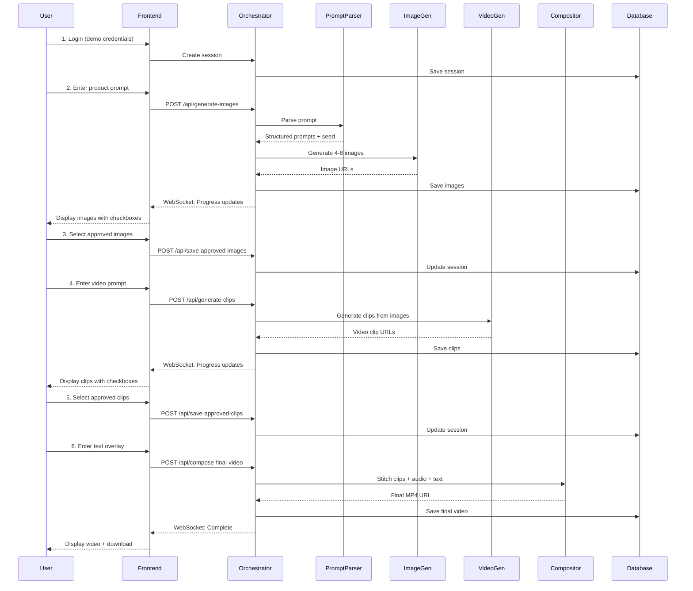

# Phase 0: Project Overview & Architecture

## Document Purpose
This document provides the strategic overview, technical architecture, and foundational understanding needed before implementation begins.

---

## 1. Executive Summary

### 1.1 Project Goal

Build an AI-powered ad video generator that produces 8-12 second product advertisement videos with:

- **Visual consistency** across all clips (same product appearance)
- **User control** at every stage (image selection, clip selection)
- **Professional output** (1080p, synchronized audio, text overlays)
- **Cost efficiency** (under $200 per final video)

### 1.2 Core Innovation

**Image-to-Video Pipeline with Multi-Agent Orchestration**

- Generate consistent product images using seed-controlled generation
- Convert approved images into video clips (Image-to-Video prevents hallucination)
- User-driven iterative workflow with selection gates
- Intelligent LLM orchestration across 4 specialized agents

### 1.3 Technical Stack

| Layer                 | Technology                                                    | Rationale                                                 |
| --------------------- | ------------------------------------------------------------- | --------------------------------------------------------- |
| **Frontend**          | Next.js 14 (App Router), TypeScript, Tailwind CSS             | Modern React framework, type safety, rapid UI development |
| **Backend**           | FastAPI (Python 3.11+), Pydantic v2                           | High-performance async API, native type validation        |
| **Database**          | PostgreSQL 15 + SQLAlchemy 2.0                                | Persistent mood board, session state management           |
| **Orchestration**     | Python Async/Await (direct function calls)                    | Simple MVP pattern, easy migration to message queue       |
| **Image Generation**  | Replicate: Flux-Pro (primary), SDXL (fallback)                | Best product photography quality, seed support            |
| **Video Generation**  | Replicate: Stable Video Diffusion (MVP), Runway Gen-2 (final) | Image-to-Video capability, cost-effective                 |
| **LLM Agents**        | Replicate: Llama 3.1 70B Instruct                             | Free/low-cost, excellent structured output                |
| **Audio Generation**  | Replicate: MusicGen (optional feature)                        | Background music for ads                                  |
| **Video Composition** | FFmpeg 6.0 (via Python subprocess)                            | Industry standard, powerful stitching                     |
| **Deployment**        | Vercel (Frontend), Railway (Backend + PostgreSQL)             | Fast deployment, integrated database                      |

### 1.4 MVP Scope (48 Hours)

**IN SCOPE:**
✅ Single product type (footwear) ad generation
✅ 4-8 image generation with seed consistency
✅ Image selection with mood board (PostgreSQL-backed)
✅ 2-6 video clip generation from approved images
✅ Clip selection and final composition (8-12 seconds)
✅ Text overlay (product name, CTA)
✅ Background music (optional toggle)
✅ Real-time progress indicators (WebSocket)
✅ Cost tracking per stage
✅ Deployed web interface

**OUT OF SCOPE (Post-MVP):**
❌ Multiple product categories
❌ A/B testing / batch generation
❌ Multiple aspect ratios (9:16, 1:1)
❌ Advanced style transfer / LoRA models
❌ Voiceover generation
❌ User authentication (demo credentials only)
❌ Message queue architecture

---

## 2. System Architecture

### 2.1 High-Level Architecture Diagram

```
┌─────────────────────────────────────────────────────────────────┐
│                         FRONTEND (Next.js)                       │
│  ┌─────────────┐  ┌──────────────┐  ┌────────────────────┐    │
│  │  Login UI   │→ │  Generation  │→ │  Mood Board UI     │    │
│  │             │  │  Workflow UI │  │  (PostgreSQL)      │    │
│  └─────────────┘  └──────────────┘  └────────────────────┘    │
└────────────────────────────┬────────────────────────────────────┘
                             │ REST API + WebSocket
┌────────────────────────────▼────────────────────────────────────┐
│                   BACKEND ORCHESTRATOR (FastAPI)                 │
│  ┌──────────────────────────────────────────────────────────┐  │
│  │              Session State Manager                        │  │
│  │  - Load/Save session from PostgreSQL                     │  │
│  │  - Track generation costs                                │  │
│  │  - Emit WebSocket progress events                        │  │
│  └───────────────────┬──────────────────────────────────────┘  │
│                      │                                           │
│  ┌───────────────────▼──────────────────────────────────────┐  │
│  │           Agent Coordinator (Direct Calls)                │  │
│  │  Manages sequential agent execution with error handling  │  │
│  └─┬─────────┬──────────┬───────────────┬───────────────────┘  │
│    │         │          │               │                       │
│ ┌──▼────┐ ┌─▼──────┐ ┌─▼──────────┐ ┌─▼────────────────┐     │
│ │ Prompt│ │ Batch  │ │   Video    │ │   Composition    │     │
│ │ Parser│ │ Image  │ │  Generator │ │     Layer        │     │
│ │ Agent │ │ Gen    │ │   Agent    │ │  (FFmpeg)        │     │
│ └───────┘ └────────┘ └────────────┘ └──────────────────┘     │
└─────────────────────────────────────────────────────────────────┘
                             │
┌────────────────────────────▼────────────────────────────────────┐
│                    EXTERNAL SERVICES                             │
│  ┌──────────────┐  ┌──────────────┐  ┌──────────────────────┐ │
│  │  Replicate   │  │  Replicate   │  │     Replicate        │ │
│  │  Llama 3.1   │  │  Flux-Pro    │  │  Stable Video Diff   │ │
│  │  (LLM)       │  │  (Images)    │  │  (Video)             │ │
│  └──────────────┘  └──────────────┘  └──────────────────────┘ │
└─────────────────────────────────────────────────────────────────┘
                             │
┌────────────────────────────▼────────────────────────────────────┐
│                  DATABASE (PostgreSQL)                           │
│  - sessions table (state management)                             │
│  - generation_costs table (cost tracking)                        │
│  - assets table (image/video URLs)                              │
└─────────────────────────────────────────────────────────────────┘
```

### 2.2 Multi-Agent Communication Pattern

**MVP: Direct Function Calls with Async/Await**

**Key Design Principles:**

1. **Sequential Execution:** Agents run one after another (not parallel) for MVP simplicity
2. **State Persistence:** Every stage saves to PostgreSQL before proceeding
3. **Progress Tracking:** WebSocket updates at every substep
4. **Error Handling:** Try-catch at orchestrator level, single retry logic
5. **Cost Tracking:** Log cost after each API call

### 2.3 Data Flow

```
User Input → Orchestrator → Agent → External API → Orchestrator → Database → Frontend

Example: Image Generation Flow
1. User: "pink tennis shoes" → Frontend
2. Frontend POST /api/generate-images → Orchestrator
3. Orchestrator → PromptParserAgent.parse()
4. PromptParserAgent → Replicate Llama 3.1 API
5. Replicate returns structured JSON → PromptParserAgent
6. PromptParserAgent → Orchestrator (parsed prompts)
7. Orchestrator → BatchImageGeneratorAgent.generate()
8. BatchImageGeneratorAgent → Replicate Flux-Pro API (6 times)
9. Replicate returns image URLs → BatchImageGeneratorAgent
10. BatchImageGeneratorAgent → Orchestrator (image results)
11. Orchestrator → Database (save assets + session)
12. Orchestrator → WebSocketManager (progress updates)
13. WebSocketManager → Frontend (real-time updates)
14. Frontend → User (display images)
```

---

## 3. User Journey Overview

### 3.1 Complete User Flow



### 3.2 Screen Flow Summary

1. **Login** → Demo credentials → Create session
2. **Product Prompt** → Generate 4-8 images → Display grid
3. **Mood Board (Images)** → Select approved images → Continue
4. **Video Prompt** → Generate 2-6 clips → Display grid
5. **Mood Board (Clips)** → Select and order clips → Continue
6. **Text Overlay & Audio** → Configure final touches → Generate
7. **Final Output** → Display video → Download

---

## 4. Cost Strategy & Budget

### 4.1 Cost Analysis

**Target: $200 per video maximum**

| Component                       | Model           | Cost   | Notes              |
| ------------------------------- | --------------- | ------ | ------------------ |
| **Prompt Parsing**              | Llama 3.1 70B   | $0.001 | Essentially free   |
| **Image Generation** (6 images) | Flux-Pro        | $0.30  | MVP & Final        |
| **Image Generation** (6 images) | SDXL (fallback) | $0.06  | Testing only       |
| **Video Scene Planning**        | Llama 3.1 70B   | $0.001 | Essentially free   |
| **Video Generation** (4 clips)  | SVD             | $3.20  | MVP testing        |
| **Video Generation** (4 clips)  | Runway Gen-2    | $6.00  | Final demo         |
| **Background Music**            | Stock library   | $0.00  | MVP (pre-existing) |
| **Background Music**            | MusicGen        | $0.30  | Post-MVP           |
| **Composition**                 | FFmpeg          | $0.50  | Storage/processing |

**MVP Total Cost:**

- Flux-Pro (images): $0.30
- Llama 3.1 (parsing + planning): $0.002
- SVD (video): $3.20
- FFmpeg (composition): $0.50
- **Total: $4.00 per video**

**Final Demo Cost:**

- Flux-Pro (images): $0.30
- Runway Gen-2 (video): $6.00
- FFmpeg (composition): $0.50
- **Total: $6.80 per video**

**Budget Remaining:** $200 - $6.80 = **$193.20 per video** ✅

### 4.2 Optimization Strategies

1. **Tiered Model Usage:** Switch models based on ENV (development vs production)
2. **Caching:** Cache prompt outputs, images for 24 hours
3. **Batch Processing:** Parallel generation with asyncio.gather
4. **Cost Tracking:** Log every API call, alert if session exceeds $10

---

## 5. Success Criteria

### 5.1 Functional Requirements

| Requirement             | Success Criteria                        |
| ----------------------- | --------------------------------------- |
| **Login**               | User can log in with demo credentials   |
| **Image Generation**    | 6 product images generated in <60s      |
| **Visual Consistency**  | All images show same product design     |
| **Image Selection**     | User can select 2+ images               |
| **Mood Board**          | Selected images persist across sessions |
| **Video Prompt**        | User can describe scene                 |
| **Clip Generation**     | 2-4 video clips generated in <180s      |
| **Clip Consistency**    | Clips visually match product images     |
| **Clip Selection**      | User can select and reorder clips       |
| **Text Overlay**        | Product name and CTA appear in video    |
| **Audio (Optional)**    | Background music plays in video         |
| **Final Video**         | 8-12 second 1080p MP4 generated         |
| **Download**            | User can download MP4 file              |
| **Cost Tracking**       | Total cost displayed and <$10           |
| **Progress Indicators** | Real-time updates during generation     |

### 5.2 Performance Requirements

| Metric                     | Target      | Acceptable Range  |
| -------------------------- | ----------- | ----------------- |
| **Image Generation Time**  | 45 seconds  | 30-60 seconds     |
| **Video Generation Time**  | 150 seconds | 120-180 seconds   |
| **Final Composition Time** | 30 seconds  | 20-45 seconds     |
| **Total End-to-End Time**  | <5 minutes  | 4-7 minutes       |
| **Cost per Video**         | $4.00 (MVP) | $3.50-$6.00       |
| **Video Resolution**       | 1920x1080   | Minimum 1920x1080 |
| **Video FPS**              | 30          | 24-30             |
| **File Size**              | <15 MB      | 10-20 MB          |

---

## 6. Implementation Timeline (48-Hour Sprint)

### Day 1 (Friday, 24 hours)

#### Hour 0-6: Foundation Setup
- Project initialization, database setup, authentication

#### Hour 6-16: Core Agent Implementation
- Orchestrator, Prompt Parser, Image Generator

#### Hour 16-24: Video Generation
- Video Scene Planning, Video Generator Agent

### Day 2 (Saturday, 24 hours)

#### Hour 24-32: Composition Layer
- Intro/outro cards, video stitching, text overlays

#### Hour 32-40: Frontend Polish & Integration
- Mood boards, composition UI, final output page

#### Hour 40-46: Testing & Optimization
- E2E testing, performance optimization, cost optimization

#### Hour 46-48: Final Polish & Deployment
- Demo videos, deployment to Railway/Vercel, documentation

---

## 7. Risk Assessment

### 7.1 Technical Risks

| Risk                     | Impact | Mitigation                                  |
| ------------------------ | ------ | ------------------------------------------- |
| Replicate API timeout    | High   | Implement retry logic, fallback models      |
| Visual inconsistency     | High   | Use seed-controlled generation, test early  |
| FFmpeg complexity        | Medium | Test composition pipeline in isolation      |
| WebSocket stability      | Medium | Implement auto-reconnect, graceful fallback |
| Database connection lost | Medium | Connection pooling, retry logic             |

### 7.2 Schedule Risks

| Risk                   | Impact | Mitigation                             |
| ---------------------- | ------ | -------------------------------------- |
| Agent integration bugs | High   | Test each agent independently first    |
| UI complexity          | Medium | Use pre-built components (shadcn/ui)   |
| Deployment issues      | Medium | Test Railway/Vercel deploy early       |
| Scope creep            | High   | Strict adherence to MVP scope document |

---

## 8. Next Steps

**Before Starting Implementation:**

1. ✅ Review this architecture document
2. ✅ Set up development environment (Python 3.11+, Node 18+)
3. ✅ Obtain API keys (Replicate, AWS S3)
4. ✅ Create GitHub repository
5. ✅ Review Phase 1 document (Foundation & Infrastructure)

**Proceed to:** [Phase_1_Foundation_Infrastructure.md](Phase_1_Foundation_Infrastructure.md)

---

## Document Metadata

- **Phase:** 0 (Overview & Architecture)
- **Dependencies:** None
- **Next Phase:** Phase 1 (Foundation & Infrastructure)
- **Estimated Review Time:** 30 minutes
- **Last Updated:** November 14, 2025
