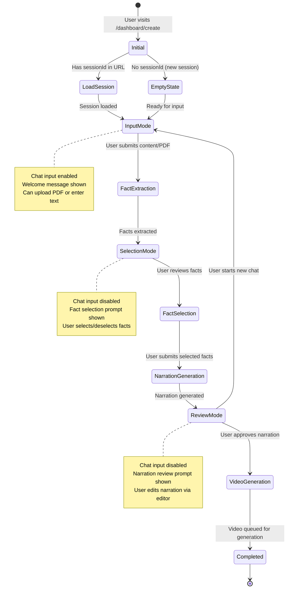
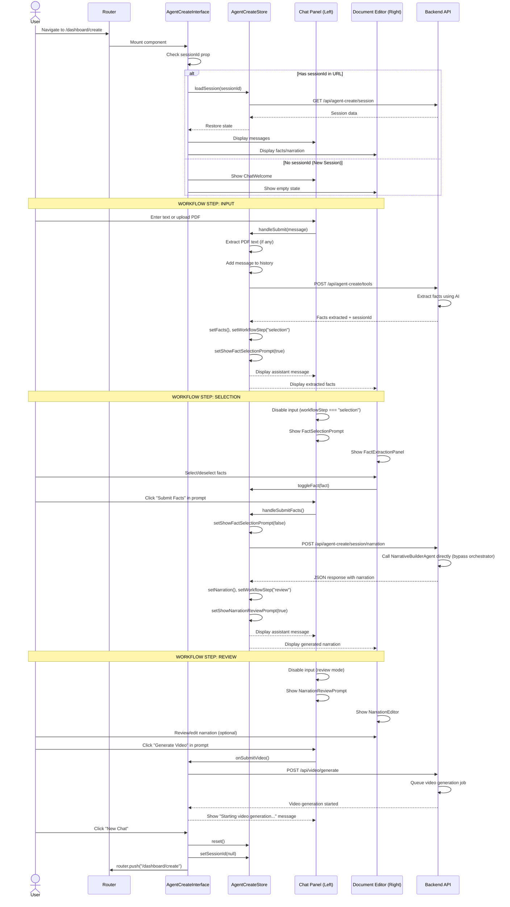
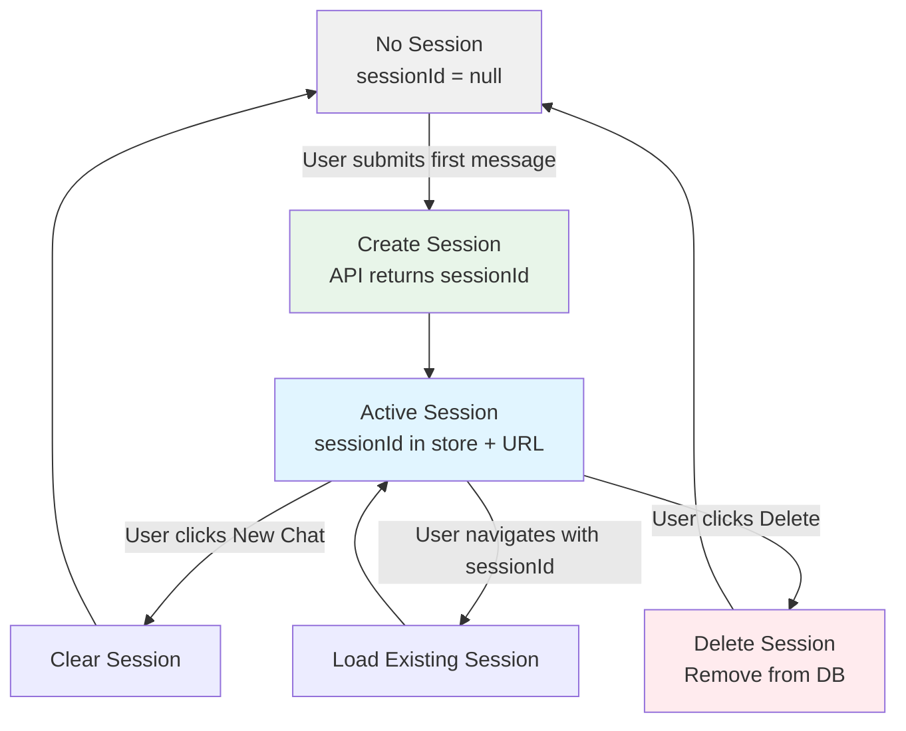
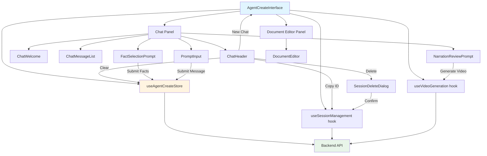

# Agent Create Interface - User Journey Documentation

## Overview

This document describes the complete user journey through the Agent Create Interface, which is a dual-panel interface for creating educational video content using AI assistance. The interface guides users through three main workflow steps: **Input**, **Selection**, and **Review**.

## Component Location

**File**: `frontend/src/components/agent-create/agent-create-interface.tsx`

## Architecture

The interface uses:

- **Zustand Store** (`agent-create-store`) for state management
- **Resizable Panel Layout** with Chat Panel (left) and Document Editor (right)
- **Session-based persistence** with URL-based session IDs
- **Multi-step workflow** with intelligent state transitions

## User Journey Overview



## Detailed User Journey Flow



## Workflow Steps Detail

### 1. Input Mode (workflowStep: "input")

**Purpose**: Collect student information and learning materials

**UI State**:

- Chat input: **Enabled**
- Placeholder: "Tell me about your student, or share lesson materials..."
- Document Editor: Empty or showing welcome message
- Prompts: None visible

**User Actions**:

1. Enter text about the student (age, interests, learning objectives)
2. Upload PDF learning materials (attach via paperclip icon)
3. Submit message

**State Transitions**:

```javascript
Input Mode → Selection Mode (when facts are extracted)
```

**Store Updates**:

```typescript
setMessages([...messages, userMessage, assistantMessage]);
setFacts(extractedFacts);
setWorkflowStep("selection");
setShowFactSelectionPrompt(true);
```

### 2. Selection Mode (workflowStep: "selection")

**Purpose**: Review and select relevant educational facts

**UI State**:

- Chat input: **Disabled**
- Placeholder: "Review and select facts on the right, then click Submit..."
- Document Editor: Displays `FactExtractionPanel` with fact cards
- Prompts: `FactSelectionPrompt` shown in chat

**User Actions**:

1. Review extracted facts in Document Editor
2. Select/deselect individual facts by clicking cards
3. Click "Submit Facts" button in `FactSelectionPrompt`

**State Transitions**:

```javascript
Selection Mode → Review Mode (when facts are submitted)
```

**Store Updates**:

```typescript
setSelectedFacts(facts); // via toggleFact()
setShowFactSelectionPrompt(false);
setNarration(generatedNarration);
setWorkflowStep("review");
setShowNarrationReviewPrompt(true);
```

### 3. Review Mode (workflowStep: "review")

**Purpose**: Review and edit generated narration before video creation

**UI State**:

- Chat input: **Disabled**
- Placeholder: "Review complete. Use the editor to make changes..."
- Document Editor: Displays `NarrationEditor` with editable script
- Prompts: `NarrationReviewPrompt` shown in chat

**User Actions**:

1. Review generated narration in Document Editor
2. Edit narration segments (optional)
3. Click "Generate Video" button in `NarrationReviewPrompt`

**State Transitions**:

```javascript
Review Mode → Video Generation (when user approves)
Review Mode → Input Mode (when user starts new chat)
```

**Store Updates**:

```typescript
setIsVideoGenerating(true);
// After successful video generation start:
// Video generation happens asynchronously
```

## Session Management

### Session States



### Session Matching Logic

The interface implements session matching to prevent stale data:

```typescript
const sessionMatches = externalSessionId
  ? externalSessionId === storeSessionId
  : !storeSessionId;

const messages = sessionMatches ? storeMessages : [];
const facts = sessionMatches ? storeFacts : [];
const selectedFacts = sessionMatches ? storeSelectedFacts : [];
const narration = sessionMatches ? storeNarration : null;
```

**Purpose**: Ensures UI only displays data from the current session, preventing:

- Showing old session data when navigating to new session
- Displaying stale data during session transitions

### Session Actions

#### 1. New Chat

**Trigger**: User clicks "New Chat" button in `ChatHeader`

**Flow**:

```typescript
handleNewChat() {
  reset()              // Clear all state except sessionId
  setSessionId(null)   // Clear sessionId
  router.push("/dashboard/create")  // Navigate to clean URL
}
```

#### 2. Clear Session

**Trigger**: User clicks "Clear Session" in chat menu

**Flow**:

```typescript
handleClearSession() {
  reset()  // Clears messages, facts, narration, workflow state
  // Keeps sessionId - allows continuing same session fresh
}
```

#### 3. Delete Session

**Trigger**: User clicks "Delete Session" and confirms in dialog

**Flow**:

```typescript
onDeleteSession() {
  deleteSession(storeSessionId)  // Calls API to delete from DB
  setShowDeleteDialog(false)     // Close dialog
  // Triggers navigation to /dashboard/create
}
```

#### 4. Copy Session ID

**Trigger**: User clicks "Copy Session ID" in chat menu

**Flow**:

```typescript
onCopySessionId() {
  navigator.clipboard.writeText(displaySessionId)
  // Shows toast notification
}
```

## Loading States

### Session Loading Skeleton

**When Shown**:

```typescript
const willLoadSession =
  externalSessionId && externalSessionId !== storeSessionId;
const showLoadingSkeleton =
  (isSessionLoading || willLoadSession) && !!externalSessionId;
```

**Conditions**:

1. Currently loading a session (`isSessionLoading = true`)
2. OR have an external sessionId that doesn't match store (about to load)

**UI Changes**:

- Chat Panel: Shows `ChatLoadingSkeleton` (animated placeholders)
- Document Editor: Shows `EditorLoadingSkeleton` (animated placeholders)
- Chat Input: Disabled with placeholder "Loading session..."

## Component Interaction Map



## Key Props and State

### Component Props

```typescript
type AgentCreateInterfaceProps = {
  sessionId?: string | null; // External sessionId from URL/route
};
```

### Store State (Relevant to Interface)

```typescript
{
  // Messages
  messages: Message[];

  // Loading states
  isLoading: boolean;
  isSessionLoading: boolean;
  error: Error | null;

  // Workflow
  workflowStep: "input" | "selection" | "review";
  thinkingStatus: { operation: "extracting" | "narrating"; steps: string[] } | null;

  // Data
  facts: Fact[];
  selectedFacts: Fact[];
  narration: Narration | null;

  // Session
  sessionId: string | null;
  sessionStatus: string | null;

  // UI Flags
  showFactSelectionPrompt: boolean;
  showNarrationReviewPrompt: boolean;
  factsLocked: boolean;

  // Student Info
  childAge: string | null;
  childInterest: string | null;
}
```

## Error Handling

### Error Display

Errors are shown in `ChatMessageList` when `error` state is present:

```typescript
{
  error && (
    <Message from="assistant">
      <MessageContent>
        <p className="text-destructive">Error: {error.message}</p>
      </MessageContent>
    </Message>
  );
}
```

### Error Recovery

Users can recover from errors by:

1. Starting a new chat (clears error state)
2. Submitting new content (resets workflow)
3. Reloading the session

## Responsive Behavior

### Panel Sizing

```typescript
<ResizablePanel defaultSize={40} minSize={30}>  // Chat Panel
<ResizablePanel defaultSize={60} minSize={30}>  // Document Editor
```

- Chat Panel: 40% default, minimum 30%
- Document Editor: 60% default, minimum 30%
- Users can drag the handle to resize panels

### Mobile Considerations

The interface uses `ResizablePanelGroup` which adapts to mobile screens, typically stacking panels vertically.

## Related Documentation

- **Chat Agent Orchestrator**: See [`chat-agent-orchestrator.md`](./chat-agent-orchestrator.md) for backend workflow details

## Future Enhancements

1. **Undo/Redo**: Track fact selection and narration edits with undo capability
2. **Auto-save**: Automatically save draft states during editing
3. **Collaborative Editing**: Multiple users working on same session
4. **Template Library**: Pre-built templates for common educational content types
5. **Preview Mode**: Preview video segments before generation
