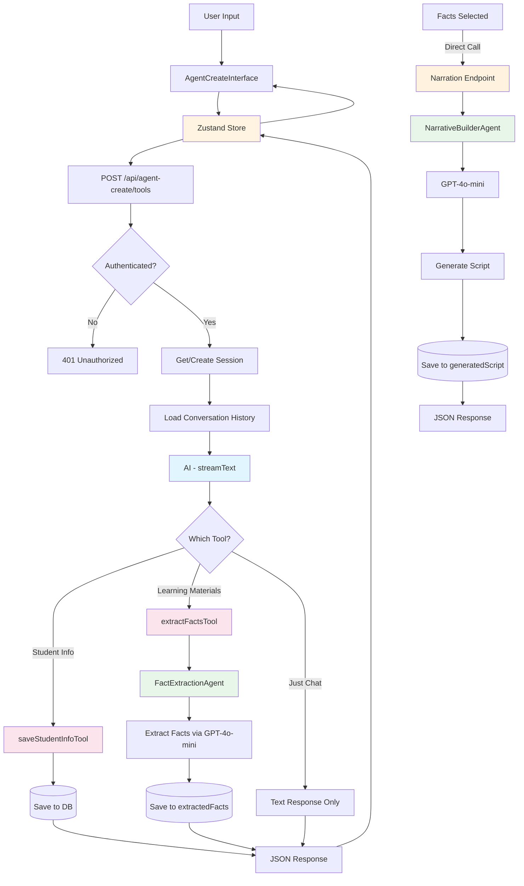
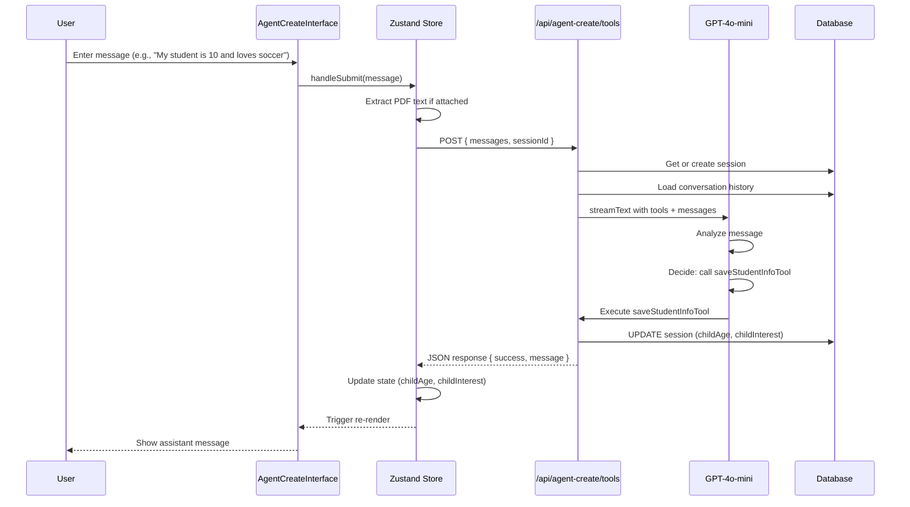
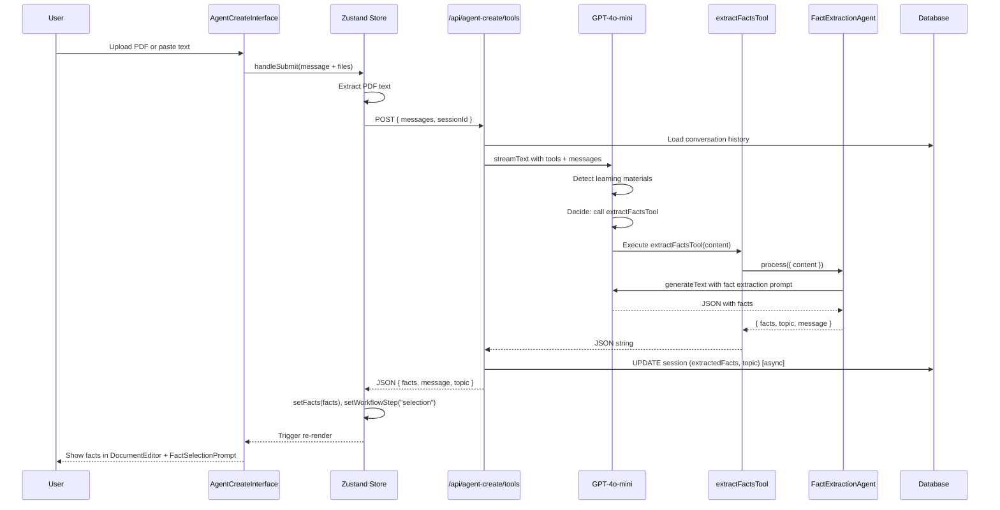
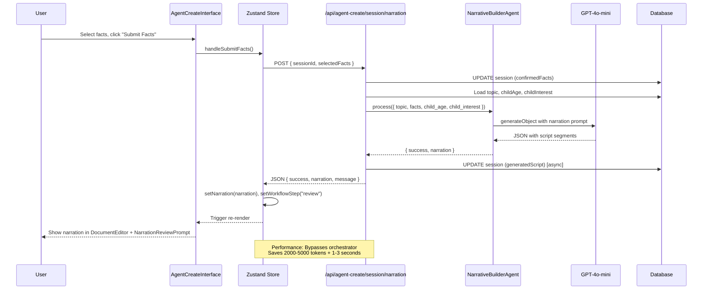
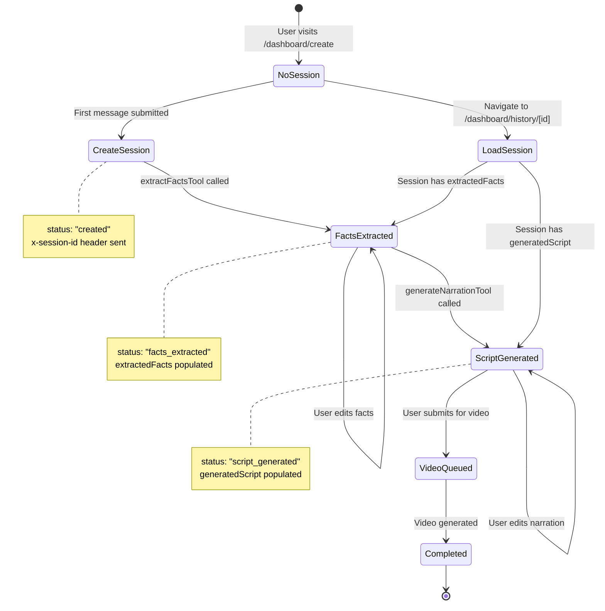

# Agent Create Chat System - Architecture Documentation

## Overview

The Agent Create chat system provides an AI-powered workflow for creating personalized educational videos. It uses **tool-based AI** to orchestrate a multi-step process: gathering student information, extracting facts from learning materials, and generating personalized narration scripts.

**Key Characteristics:**

- Tool-calling AI with `streamText()` from Vercel AI SDK
- Two specialized tools wrapping dedicated agent classes (fact extraction, student info)
- Direct agent calls for narration generation (bypasses orchestrator for performance)
- JSON-based responses (not streaming objects)
- Session-based state persistence
- Zustand store for client-side state management

## Architecture Principles

### 1. **Tool-Based AI Pattern**

The system uses AI SDK's tool calling where the LLM decides which tools to invoke based on conversation context:

- **AI decides** which tool(s) to call
- **Tools wrap agents** that perform specialized tasks
- **Tools return JSON** with results and user-facing messages
- **Flexible flow** - not locked into rigid step sequences

### 2. **Separation of Concerns**

- **Frontend (Zustand)**: UI state, workflow steps, user interactions
- **Backend (Tools)**: AI decision-making, fact extraction, script generation
- **Database**: Session persistence, conversation history, structured data
- **Agents**: Specialized AI processing (facts, narration)

### 3. **Session-Based Persistence**

- Each conversation has a unique `sessionId`
- Sessions store: messages, facts, student info, generated scripts
- Sessions enable resumption and history viewing
- URL-based session routing for deep linking

### 4. **File Handling Optimization**

To prevent unnecessary token usage, file attachments are stripped before sending messages to the LLM:

- **PDF Upload Flow**:

  1. Client uploads PDF → Extracted to S3 via `processPdfUploads()` utility
  2. S3 URL stored in message parts for UI display
  3. Before sending to LLM: `stripFileParts()` removes file attachments
  4. PDF URL extracted separately and passed to `extractFactsTool` via wrapper

- **Benefits**:
  - LLM never receives binary/file data (can't process anyway)
  - Reduced token usage and latency
  - Cleaner context for AI decision-making
  - Tools receive PDF URLs via parameter injection

**Implementation**: `stripFileParts()` in `/api/agent-create/route.ts` filters out `file` type parts before calling `convertToModelMessages()`.

## Architecture Diagram



**Note**: The "Narration Endpoint" refers to `POST /api/agent-create/session/narration`, which bypasses the orchestrator for direct narration generation.

## Database Schema

### Video Sessions Table

Stores session state and structured data:

```typescript
{
  id: string;                      // Primary key (nanoid)
  userId: string;                  // Foreign key to users
  status: string;                  // 'created' | 'facts_extracted' | 'script_generated' | etc.
  topic: string | null;            // Main topic (e.g., "American Revolution")
  childAge: string | null;         // Student age (e.g., "10")
  childInterest: string | null;    // Student interest (e.g., "soccer")
  learningObjective: string | null; // Learning goal
  extractedFacts: Fact[] | null;   // All extracted facts (pending review)
  confirmedFacts: Fact[] | null;   // User-selected facts
  generatedScript: Narration | null; // Generated script with segments
  sourceMaterials: JSON | null;    // PDF URLs and extracted text ({text?: string, pdfUrl?: string})
  createdAt: Date;
  updatedAt: Date;
}
```

**Key Points:**

- `extractedFacts`: Facts from AI extraction (user can review/select)
- `confirmedFacts`: User-approved subset used for narration
- `generatedScript`: Final narration with segments, timing, visuals
- `sourceMaterials`: Stores PDF URLs and extracted text separately from conversation
- `childAge` + `childInterest`: Used for personalization

### Conversation Messages Table

Stores text conversation history:

```typescript
{
  id: string;                // Primary key
  sessionId: string;         // Foreign key to video_sessions
  role: 'user' | 'assistant' | 'system';
  content: string;           // Text content only
  parts: UIMessagePart[] | null; // File attachments, etc.
  metadata: JSON | null;     // Workflow context, references
  createdAt: Date;
}
```

**Key Points:**

- Stores **text-only** conversation
- `parts` contains file attachments (PDFs)
- `metadata` can reference structured data
- Used for session resumption and display

### Video Assets Table

Stores generated/uploaded media:

```typescript
{
  id: string;
  sessionId: string;
  assetType: string; // 'image' | 'audio' | 'video'
  url: string | null; // S3 URL or external URL
  metadata: JSON | null; // Asset-specific data
  createdAt: Date;
}
```

## API Route: `/api/agent-create/route.ts`

**Location**: `frontend/src/app/api/agent-create/route.ts`

**Purpose**: Handles conversational AI interactions for student info gathering and fact extraction

### Request Format

```typescript
POST /api/agent-create
Content-Type: application/json

{
  "messages": UIMessage[],      // Conversation history
  "sessionId": string | null    // Optional: existing session
}
```

### Response Format

All API responses follow a standardized format via `StandardApiResponse`:

```typescript
{
  "success": boolean,
  "facts"?: Fact[],
  "narration"?: Narration,
  "message"?: string,
  "topic"?: string,
  "learningObjective"?: string,
  "childAge"?: string,
  "childInterest"?: string,
  "error"?: string
}

// Headers:
X-Session-Id: string  // Returned on first message if new session
```

**Helper Functions** (`lib/api-response.ts`):

- `buildStandardResponse()`: Normalizes tool results into standard format
- `unwrapToolResult()`: Unwraps AI SDK tool result wrappers and parses JSON strings

**Note**: Narration generation now uses a separate endpoint (see "Direct Narration Endpoint" section below) for optimal performance.

### System Prompt

The AI is guided by a conversational system prompt:

```typescript
const systemPrompt = `You are an AI assistant helping teachers create educational videos.

CRITICAL RULES - Follow these EXACTLY:

1. If user mentions student age/interests → call saveStudentInfoTool
2. If user message says "PDF materials uploaded for analysis" OR provides lesson content → IMMEDIATELY call extractFactsTool
3. DO NOT just acknowledge uploads - you MUST call extractFactsTool

When calling extractFactsTool:
- Pass the user's message text as the content parameter
- The tool will automatically access the PDF from the file attachment

After extracting facts, the user will select which ones to use.`;
```

## Tools

### 1. saveStudentInfoTool

**Purpose**: Capture student age and interests for personalization

**Location**: `frontend/src/app/api/agent-create/tools/_tools/save-student-info-tool.ts`

**Input Schema**:

```typescript
{
  child_age: string;      // "7", "10", "12 years old"
  child_interest: string; // "soccer", "Minecraft", "dinosaurs"
  sessionId?: string;     // Injected by route
}
```

**Process**:

1. Validates sessionId exists
2. Updates session record with `childAge` and `childInterest`
3. Returns success message

**Output**:

```typescript
{
  success: boolean;
  message: string;
  child_age: string;
  child_interest: string;
}
```

**Database Update**:

```sql
UPDATE video_session
SET child_age = $1, child_interest = $2, updated_at = NOW()
WHERE id = $sessionId
```

### 2. extractFactsTool

**Purpose**: Extract educational facts from learning materials

**Location**: `frontend/src/app/api/agent-create/tools/_tools/extract-facts-tools.ts`

**Input Schema**:

```typescript
{
  content: string;    // PDF text, URL content, or direct text
  sessionId?: string; // Injected by route
}
```

**Process**:

1. Loads `sourceMaterials` from session if `sessionId` provided
   - Extracts `pdfUrl` if available for direct PDF processing
   - Uses extracted text as fallback if no PDF URL
2. Calls `FactExtractionAgent` with content and optional PDF URL
3. Agent can process PDFs directly by converting to data URL
4. Agent uses GPT-5-mini with structured output (`generateObject()`)
5. Extracts 5-15 facts with concept, details, confidence
6. Detects topic and learning objective
7. Returns structured JSON via Zod schema validation

**Output**:

```typescript
{
  facts: Array<{
    concept: string; // "American Revolution"
    details: string; // 2-4 sentence explanation
    confidence: number; // 0-1 score
  }>;
  message: string;
  topic: string;
  learningObjective: string;
}
```

**Database Update** (non-blocking):

```sql
UPDATE video_session
SET extracted_facts = $facts,
    topic = $topic,
    learning_objective = $objective,
    status = 'facts_extracted',
    updated_at = NOW()
WHERE id = $sessionId
```

### 3. generateNarrationTool

> **⚠️ Note**: This tool is **no longer used by the orchestrator** as of the performance optimization update. Narration generation now happens through a direct endpoint (`/api/agent-create/session/narration`) that calls `NarrativeBuilderAgent` directly, bypassing the orchestrator to eliminate unnecessary token overhead (2000-5000 tokens) and reduce latency by 1-3 seconds. The tool file is preserved for reference and potential future use.

**Purpose**: Generate structured video script from confirmed facts (Legacy - See direct endpoint below)

**Location**: `frontend/src/app/api/agent-create/_tools/generate-narration-tool.ts`

**Input Schema**:

```typescript
{
  facts: Array<{
    concept: string;
    details: string;
    confidence?: number;
  }>;
  topic?: string;
  target_duration?: number;  // Default: 60 seconds
  child_age?: string;
  child_interest?: string;
  sessionId?: string;        // Injected by route
}
```

**Process**:

1. Loads `confirmedFacts`, `topic`, `childAge`, `childInterest` from session if available
2. Falls back to request parameters
3. Calls `NarrativeBuilderAgent`
4. Agent generates 4-segment script:
   - **Hook** (0-10s): Engaging question or fact
   - **Concept Introduction** (10-25s): Key vocabulary
   - **Process Explanation** (25-45s): How/why it works
   - **Conclusion** (45-60s): Real-world connection
5. Adjusts language complexity based on `childAge`
6. Incorporates `childInterest` into examples

**Output**:

```typescript
{
  narration: {
    total_duration: number;
    reading_level: string;
    key_terms_count: number;
    segments: Array<{
      id: string;
      type:
        | "hook"
        | "concept_introduction"
        | "process_explanation"
        | "conclusion";
      start_time: number;
      duration: number;
      narration: string;
      visual_guidance: string;
      key_concepts: string[];
      educational_purpose: string;
    }>;
  }
  message: string;
}
```

**Database Update** (non-blocking):

```sql
UPDATE video_session
SET generated_script = $narration,
    status = 'script_generated',
    updated_at = NOW()
WHERE id = $sessionId
```

## Direct Narration Endpoint (Current Implementation)

**Location**: `frontend/src/app/api/agent-create/session/narration/route.ts`

### POST - Generate Narration

This endpoint bypasses the orchestrator AI and calls `NarrativeBuilderAgent` directly for optimal performance.

**Request Format**:

```typescript
POST /api/agent-create/session/narration
Content-Type: application/json

{
  "sessionId": string,
  "selectedFacts": Fact[]  // Teacher-selected facts to include in narration
}
```

**Process**:

1. Authenticates user
2. Saves `selectedFacts` as `confirmedFacts` in database
3. Loads `topic`, `childAge`, `childInterest` from session
4. Calls `NarrativeBuilderAgent.process()` directly (no orchestrator overhead)
5. Saves generated narration to database
6. Returns JSON response

**Response Format**:

```typescript
{
  "success": boolean,
  "narration": Narration,
  "message": string
}
```

**Performance Benefit**:

- **Token Reduction**: Eliminates 2000-5000 tokens of conversation history
- **Latency Reduction**: Saves 1-3 seconds by bypassing orchestrator AI decision-making
- **Cost Savings**: ~70-80% reduction in API costs for narration generation

### PATCH - Verify Narration & Trigger Diagram Selection

Updates the session with verified narration and triggers diagram selection.

**Request Format**:

```typescript
PATCH /api/agent-create/session/narration
Content-Type: application/json

{
  "sessionId": string,
  "narration": Narration
}
```

**Process**:

1. Authenticates user and validates session
2. Updates `generatedScript` and sets `status` to `narration_verified`
3. Loads `confirmedFacts` (teacher-selected concepts)
4. Triggers `selectAndCopyDiagrams` in background with:
   - Narration text (concise, ~500-800 tokens)
   - Confirmed facts (teacher-selected concepts, 5-15 items)
   - Session context for image matching

**Diagram Selection Optimization**:

- **Before**: Sent entire narration object (2000-3000 tokens) without facts
- **After**: Sends concise narration text + confirmed facts (~700-1000 tokens)
- **Token Reduction**: 60-70% savings on vision AI calls
- **Accuracy Improvement**: Teacher-selected facts improve image relevance

**Response Format**:

```typescript
{
  "success": boolean,
  "message": string
}
```

## Agents

### FactExtractionAgent

**Location**: `frontend/src/server/agents/fact-extraction.ts`

**Technology**: Uses `generateObject()` from Vercel AI SDK with Zod schema validation

**Model**: GPT-5-mini (gpt-5-mini-2025-08-07)

**System Prompt Highlights**:

- Extract 5-15 key educational facts
- Focus on historical concepts, events, figures
- Ensure clarity, accuracy, age-appropriateness
- Provide concept + details + confidence score
- Identify topic and learning objective

**PDF Processing**:

- If `pdfUrl` is provided, fetches PDF and converts to base64 data URL
- Sends PDF directly to AI model as file attachment
- Falls back to text-only if PDF fetch fails
- Supports both direct PDF analysis and text extraction

**Input**:

```typescript
{
  sessionId: string;
  data: {
    content: string;
    pdfUrl?: string;  // Optional: Direct PDF URL for AI processing
  }
}
```

**Output**:

```typescript
{
  success: boolean;
  data: {
    facts: Fact[];
    message: string;
    topic: string;
    learningObjective: string;
  };
  cost: number;    // Estimated API cost
  duration: number; // Processing time in seconds
  error?: string;
}
```

### NarrativeBuilderAgent

**Location**: `frontend/src/server/agents/narrative-builder.ts`

**Technology**: Uses `generateObject()` from Vercel AI SDK with Zod schema validation

**Model**: GPT-5-mini (gpt-5-mini-2025-08-07)

**System Prompt Features**:

- Age-appropriate language adjustment
- Interest-based personalization
- 4-part script structure
- Conversational, enthusiastic tone
- Visual guidance for each segment

**Age Brackets**:

- Ages 4-6: Reading level ~2.5
- Ages 6-8: Reading level ~3.5
- Ages 9-11: Reading level ~4.5
- Ages 12-14: Reading level ~6.5
- Ages 15+: Reading level ~8.5

**Input**:

```typescript
{
  sessionId: string;
  data: {
    topic: string;
    facts: Array<{ concept: string; details: string }>;
    target_duration: number;
    child_age: string | null;
    child_interest: string | null;
  }
}
```

**Output**:

```typescript
{
  success: boolean;
  data: {
    script: Narration;
  };
  cost: number;
  duration: number;
  error?: string;
}
```

## Workflow Sequence

### 1. Initial User Message



### 2. Extract Facts from Learning Materials



### 3. Generate Narration from Selected Facts (Direct Endpoint)



## Session Management

### Session Lifecycle



### Session Utilities

**Location**: `frontend/src/server/utils/session-utils.ts`

**`getSessionIdFromRequest(req, body)`**

- Checks: Header (`x-session-id`) → Body (`sessionId`) → Query param → null
- Returns: `string | null`

**`validateSession(sessionId, userId)`**

- Ensures session exists and belongs to user
- Returns: `boolean`

**`getOrCreateSession(userId, sessionId?)`**

- If sessionId valid: returns it
- If sessionId invalid/missing: creates new session with nanoid
- Returns: `string` (sessionId)

## Frontend Integration

### Zustand Store

**Location**: `frontend/src/stores/agent-create-store.ts`

**Key State**:

```typescript
{
  // Messages
  messages: Message[];

  // Workflow
  workflowStep: "input" | "selection" | "review";

  // Data
  facts: Fact[];
  selectedFacts: Fact[];
  narration: Narration | null;

  // Session
  sessionId: string | null;

  // Student Info
  childAge: string | null;
  childInterest: string | null;

  // UI
  showFactSelectionPrompt: boolean;
  showNarrationReviewPrompt: boolean;
}
```

**Key Actions**:

- `handleSubmit()` - Sends message to API, handles PDF extraction
- `handleSubmitFacts()` - Saves selected facts, triggers narration
- `loadSession()` - Loads session from DB for history view
- `reset()` - Clears state for new session

### Component Hierarchy

```
AgentCreateInterface
├── ChatPanel (left 40%)
│   ├── ChatHeader
│   ├── ChatWelcome (if no messages)
│   ├── ChatMessageList
│   │   ├── Message (user/assistant)
│   │   └── ScriptGenerationChainOfThought (during loading)
│   ├── FactSelectionPrompt (if workflowStep === "selection")
│   ├── NarrationReviewPrompt (if workflowStep === "review")
│   └── PromptInput
└── DocumentEditor (right 60%)
    ├── FactExtractionPanel (if facts exist)
    └── NarrationEditor (if narration exists)
```

## Error Handling

### API Errors

```typescript
try {
  const result = streamText({ ... });
  await result.text;
  return Response({ ...toolResults });
} catch (error) {
  return Response({
    error: "Failed to process request",
    message: error.message
  }, { status: 500 });
}
```

### Tool Errors

Tools catch errors and return objects (AI SDK handles serialization):

```typescript
try {
  // ... tool logic
  return {
    success: true,
    facts: extractedFacts,
    message: "Successfully extracted facts",
  };
} catch (error) {
  return {
    success: false,
    message: `Failed: ${error.message}`,
  };
}
```

### Agent Errors

Agents return structured error responses:

```typescript
{
  success: false,
  data: {},
  cost: 0.0,
  duration: elapsed,
  error: error.message
}
```

### Frontend Error Display

```typescript
{
  error && (
    <div className="p-4 text-sm text-red-500">Error: {error.message}</div>
  );
}
```

## Cost Tracking

Both agents track OpenAI API costs:

**Current Model Pricing** (GPT-5-mini reference pricing):

- Input: ~$0.15 per 1M tokens
- Output: ~$0.60 per 1M tokens

**Note**: Actual pricing may vary by model version. Check OpenAI pricing for current rates.

```typescript
const cost =
  (inputTokens * 0.15) / 1_000_000 + (outputTokens * 0.6) / 1_000_000;
```

Agents return `cost` and `duration` in their response for monitoring.

## Utilities

### PDF Upload Processing (`lib/pdf-upload.ts`)

Extracted from the Zustand store for better separation of concerns:

**Functions**:

- `processPdfUploads()`: Main entry point

  - Fetches PDF blobs
  - Extracts text using `extractTextFromPDF()`
  - Uploads to S3
  - Returns S3 URLs as `FileUIPart[]`
  - Backgrounds image extraction (non-blocking)

- `backgroundExtractImages()`: Async background task
  - Extracts images from PDF
  - Uploads to S3
  - Fire-and-forget (doesn't block chat flow)

**Benefits**:

- Testable: Can unit test PDF logic independently
- Reusable: Can use in other components
- Cleaner store: Reduced from 735 to 640 lines (~13% reduction)

### API Response Helpers (`lib/api-response.ts`)

Standardizes all API responses for consistency:

**Types**:

- `StandardApiResponse`: Interface for all tool/API responses

**Functions**:

- `unwrapToolResult()`: Handles AI SDK wrapper unwrapping + JSON parsing
- `buildStandardResponse()`: Normalizes tool results to standard format

**Benefits**:

- Single source of truth for response parsing
- Eliminates ~150 lines of redundant parsing logic
- Full type safety across frontend/backend boundary

## File Structure

```
frontend/src/
├── app/
│   └── api/
│       └── agent-create/
│           ├── route.ts                    # Main chat endpoint (student info + facts)
│           ├── session/
│           │   ├── route.ts                # GET session data
│           │   └── narration/
│           │       └── route.ts            # POST/PATCH narration (direct agent call)
│           └── _tools/
│               ├── save-student-info-tool.ts
│               ├── extract-facts-tools.ts
│               └── generate-narration-tool.ts  # Preserved for reference (not used)
├── lib/
│   ├── api-response.ts              # StandardApiResponse type & helpers
│   ├── pdf-upload.ts                # PDF processing utilities
│   ├── extractPDF.ts                # PDF text extraction
│   └── pdf-image-extractor.ts       # PDF image extraction
├── server/
│   ├── agents/
│   │   ├── fact-extraction.ts
│   │   └── narrative-builder.ts
│   └── utils/
│       ├── session-utils.ts
│       └── message-utils.ts
├── stores/
│   └── agent-create-store.ts
└── components/
    └── agent-create/
        ├── agent-create-interface.tsx      # Main interface
        ├── chat/
        │   ├── chat-header.tsx
        │   ├── chat-welcome.tsx
        │   └── chat-message-list.tsx
        ├── prompts/
        │   ├── fact-selection-prompt.tsx
        │   └── narration-review-prompt.tsx
        └── editors/
            └── document-editor.tsx
```

## Key Design Decisions

### 1. Why Hybrid Approach (Tool Calling + Direct Agents)?

**Current Approach**: Tool calling for input phase + Direct agent calls for generation

**Input Phase** (Student info & Facts): Uses `streamText()` with 2 tools

- Simpler implementation for conversational gathering
- Lower latency (one AI call decides which tool)
- Easier to debug
- Works well for flexible conversation flow

**Generation Phase** (Narration): Direct agent endpoint

- Bypasses orchestrator to eliminate conversation history overhead
- Saves 2000-5000 tokens (70-80% cost reduction)
- Reduces latency by 1-3 seconds
- Simpler, more predictable flow for deterministic actions

**Why Not Full Orchestrator?**

- Overkill for 2 tools in input phase
- Conversation history becomes noise during generation
- Direct calls offer better performance for deterministic steps

### 2. Why Consume Stream for JSON Response?

**Current**: Use `streamText()` but consume full stream, return JSON

- Simpler client handling
- Complete results at once
- Works well with Zustand store
- Tools use `generateObject()` for structured output

**Note**: The main orchestrator uses `streamText()` for tool calling, but individual agent tools use `generateObject()` for structured JSON with Zod validation.

**Streaming** (future enhancement):

- Stream tool results progressively to client
- Better UX with progressive updates
- Lower perceived latency
- More complex state management

### 3. Why Non-Blocking Database Updates?

Tool results are saved to database asynchronously:

- Faster API responses
- Don't block on DB latency
- Errors don't fail the request
- Trade-off: Potential inconsistency (acceptable for this use case)

## Recent Optimizations

### 1. ✅ Direct Narration Generation (Completed)

**Problem**: Orchestrator received 2000-5000 tokens of conversation history to decide to call narration tool

**Solution**: Bypass orchestrator with direct endpoint `/api/agent-create/session/narration`

**Impact**:

- Token reduction: 70-80% (from ~2500 to ~500 tokens)
- Latency reduction: 1-3 seconds
- Cost savings: Significant reduction in API costs
- Simplified flow: Predictable, deterministic generation

### 2. ✅ Optimized Diagram Selection (Completed)

**Problem**: Vision AI received entire narration object (2000-3000 tokens) without teacher context

**Solution**: Send concise narration text + teacher-selected facts

**Impact**:

- Token reduction: 60-70% per image analysis
- Accuracy improvement: Teacher-selected concepts improve relevance
- Better matching: Facts provide conceptual context for image selection

### 3. ✅ Standardized Response Format (Completed)

**Problem**: Response parsing happened in 3 different places with inconsistent formats

**Solution**: Created `StandardApiResponse` type and centralized parsing utilities (`lib/api-response.ts`)

**Impact**:

- Code reduction: ~150 lines removed (redundant parsing logic)
- Type safety: Full autocomplete and compile-time checks
- Maintainability: Single source of truth for response handling
- Bug reduction: Fixed duplicate message issue

### 4. ✅ File Attachment Optimization (Completed)

**Problem**: LLM received PDF file attachments it couldn't process, wasting tokens

**Solution**: `stripFileParts()` removes files before sending to LLM; tools receive URLs separately

**Impact**:

- Token reduction: Eliminates file data from LLM context
- Faster responses: Less data to process
- Cleaner architecture: Clear separation between display and processing

### 5. ✅ PDF Processing Refactor (Completed)

**Problem**: 105 lines of PDF processing inline in Zustand store

**Solution**: Extracted to `lib/pdf-upload.ts` utility

**Impact**:

- Store reduction: 735 → 640 lines (13% smaller)
- Testability: Can unit test PDF logic independently
- Reusability: Available for other components
- Maintainability: Easier to update PDF handling

### 6. ✅ Tools Return Objects (Completed)

**Problem**: Tools returned JSON strings that required parsing in multiple places

**Solution**: Tools return plain objects; AI SDK handles serialization automatically

**Impact**:

- Simpler code: No manual JSON.stringify() calls
- Fewer errors: Eliminates JSON parsing failures
- Better DX: Cleaner tool implementations

## Future Enhancements

1. **Streaming Structured Outputs**

   - Use `streamObject()` for real-time fact/narration generation
   - Progressive UI updates as data streams in
   - Note: Requires careful state management to avoid overcomplication

2. **Image Selection Tool**

   - Google Programmable Search integration
   - Return top 6 images for user selection
   - S3 upload for selected images

3. **Further Cost Optimization**

   - Cache extracted facts for similar content
   - Use GPT-4o-mini for most tasks, GPT-4 only when needed
   - Batch operations where possible

4. **Enhanced Personalization**

   - Learning style detection
   - Multiple interest incorporation
   - Adaptive difficulty based on prior interactions

5. **Error Recovery**

   - Automatic retry with exponential backoff
   - Fallback to simpler prompts if complex ones fail
   - User-friendly error messages with suggested actions

6. **Analytics**
   - Track tool usage patterns
   - Monitor costs per session
   - Measure success rates for each agent

## Related Documentation

- **Frontend User Journey**: See [`agent-create-interface-journey.md`](./agent-create-interface-journey.md) for UI flow and component details
