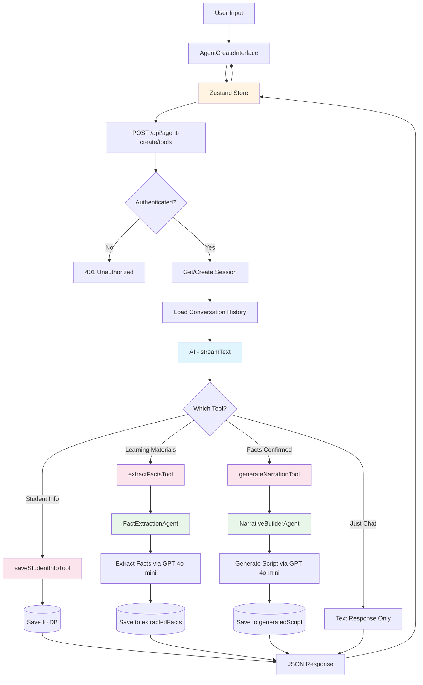
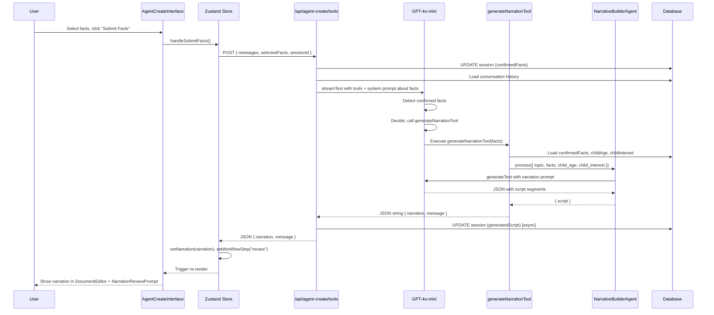

# Agent Create Chat System - Architecture Documentation

## Overview

The Agent Create chat system provides an AI-powered workflow for creating personalized educational videos. It uses **tool-based AI** to orchestrate a multi-step process: gathering student information, extracting facts from learning materials, and generating personalized narration scripts.

**Key Characteristics:**

- Tool-calling AI with `streamText()` from Vercel AI SDK
- Three specialized tools wrapping dedicated agent classes
- JSON-based responses (not streaming objects)
- Session-based state persistence
- Zustand store for client-side state management

## Architecture Principles

### 1. **Tool-Based AI Pattern**

The system uses AI SDK's tool calling where the LLM decides which tools to invoke based on conversation context:

- **AI decides** which tool(s) to call
- **Tools wrap agents** that perform specialized tasks
- **Tools return JSON** with results and user-facing messages
- **Flexible flow** - not locked into rigid step sequences

### 2. **Separation of Concerns**

- **Frontend (Zustand)**: UI state, workflow steps, user interactions
- **Backend (Tools)**: AI decision-making, fact extraction, script generation
- **Database**: Session persistence, conversation history, structured data
- **Agents**: Specialized AI processing (facts, narration)

### 3. **Session-Based Persistence**

- Each conversation has a unique `sessionId`
- Sessions store: messages, facts, student info, generated scripts
- Sessions enable resumption and history viewing
- URL-based session routing for deep linking

## Architecture Diagram



## Database Schema

### Video Sessions Table

Stores session state and structured data:

```typescript
{
  id: string;                      // Primary key (nanoid)
  userId: string;                  // Foreign key to users
  status: string;                  // 'created' | 'facts_extracted' | 'script_generated' | etc.
  topic: string | null;            // Main topic (e.g., "American Revolution")
  childAge: string | null;         // Student age (e.g., "10")
  childInterest: string | null;    // Student interest (e.g., "soccer")
  learningObjective: string | null; // Learning goal
  extractedFacts: Fact[] | null;   // All extracted facts (pending review)
  confirmedFacts: Fact[] | null;   // User-selected facts
  generatedScript: Narration | null; // Generated script with segments
  sourceMaterials: JSON | null;    // PDF URLs and extracted text ({text?: string, pdfUrl?: string})
  createdAt: Date;
  updatedAt: Date;
}
```

**Key Points:**

- `extractedFacts`: Facts from AI extraction (user can review/select)
- `confirmedFacts`: User-approved subset used for narration
- `generatedScript`: Final narration with segments, timing, visuals
- `sourceMaterials`: Stores PDF URLs and extracted text separately from conversation
- `childAge` + `childInterest`: Used for personalization

### Conversation Messages Table

Stores text conversation history:

```typescript
{
  id: string;                // Primary key
  sessionId: string;         // Foreign key to video_sessions
  role: 'user' | 'assistant' | 'system';
  content: string;           // Text content only
  parts: UIMessagePart[] | null; // File attachments, etc.
  metadata: JSON | null;     // Workflow context, references
  createdAt: Date;
}
```

**Key Points:**

- Stores **text-only** conversation
- `parts` contains file attachments (PDFs)
- `metadata` can reference structured data
- Used for session resumption and display

### Video Assets Table

Stores generated/uploaded media:

```typescript
{
  id: string;
  sessionId: string;
  assetType: string; // 'image' | 'audio' | 'video'
  url: string | null; // S3 URL or external URL
  metadata: JSON | null; // Asset-specific data
  createdAt: Date;
}
```

## API Route: `/api/agent-create/tools`

**Location**: `frontend/src/app/api/agent-create/tools/route.ts`

### Request Format

```typescript
POST /api/agent-create/tools
Content-Type: application/json

{
  "messages": UIMessage[],      // Conversation history
  "selectedFacts": Fact[],      // Optional: confirmed facts
  "sessionId": string | null    // Optional: existing session
}
```

### Response Format

```typescript
{
  // From tool execution
  "type": "tool-result",
  "output": string,  // JSON string containing:

  // For extractFactsTool:
  {
    "facts": Fact[],
    "message": string,
    "topic": string,
    "learningObjective": string
  }

  // For generateNarrationTool:
  {
    "narration": Narration,
    "message": string
  }

  // For saveStudentInfoTool:
  {
    "success": boolean,
    "message": string,
    "child_age": string,
    "child_interest": string
  }
}

// Headers:
X-Session-Id: string  // Returned on first message if new session
```

### System Prompt

The AI is guided by a conversational system prompt:

```typescript
const systemPrompt = `You are an expert educational AI assistant helping teachers create personalized history videos for individual students.

Your role:
- Help teachers create engaging history videos tailored to specific students
- Gather student information (age and interests) when provided to personalize content
- Extract key facts from lesson materials
- Generate age-appropriate, personalized narration scripts

Available Tools:
1. saveStudentInfoTool - Save student age and interest for personalization (OPTIONAL)
2. extractFactsTool - Extract educational facts from learning materials
3. generateNarrationTool - Generate a structured narration/script from confirmed facts

Conversation Flow (FLEXIBLE):
- If the teacher mentions student age or interests, use saveStudentInfoTool
- When the teacher provides lesson content/materials, ALWAYS use extractFactsTool
- After facts are selected, use generateNarrationTool
- Personalization is OPTIONAL but recommended

Key Guidelines:
- Be warm, conversational, and helpful
- Gently encourage personalization but don't require it
- Always extract facts when content is provided
- Guide the teacher through the process naturally`;
```

## Tools

### 1. saveStudentInfoTool

**Purpose**: Capture student age and interests for personalization

**Location**: `frontend/src/app/api/agent-create/tools/_tools/save-student-info-tool.ts`

**Input Schema**:

```typescript
{
  child_age: string;      // "7", "10", "12 years old"
  child_interest: string; // "soccer", "Minecraft", "dinosaurs"
  sessionId?: string;     // Injected by route
}
```

**Process**:

1. Validates sessionId exists
2. Updates session record with `childAge` and `childInterest`
3. Returns success message

**Output**:

```typescript
{
  success: boolean;
  message: string;
  child_age: string;
  child_interest: string;
}
```

**Database Update**:

```sql
UPDATE video_session
SET child_age = $1, child_interest = $2, updated_at = NOW()
WHERE id = $sessionId
```

### 2. extractFactsTool

**Purpose**: Extract educational facts from learning materials

**Location**: `frontend/src/app/api/agent-create/tools/_tools/extract-facts-tools.ts`

**Input Schema**:

```typescript
{
  content: string;    // PDF text, URL content, or direct text
  sessionId?: string; // Injected by route
}
```

**Process**:

1. Loads `sourceMaterials` from session if `sessionId` provided
   - Extracts `pdfUrl` if available for direct PDF processing
   - Uses extracted text as fallback if no PDF URL
2. Calls `FactExtractionAgent` with content and optional PDF URL
3. Agent can process PDFs directly by converting to data URL
4. Agent uses GPT-5-mini with structured output (`generateObject()`)
5. Extracts 5-15 facts with concept, details, confidence
6. Detects topic and learning objective
7. Returns structured JSON via Zod schema validation

**Output**:

```typescript
{
  facts: Array<{
    concept: string; // "American Revolution"
    details: string; // 2-4 sentence explanation
    confidence: number; // 0-1 score
  }>;
  message: string;
  topic: string;
  learningObjective: string;
}
```

**Database Update** (non-blocking):

```sql
UPDATE video_session
SET extracted_facts = $facts,
    topic = $topic,
    learning_objective = $objective,
    status = 'facts_extracted',
    updated_at = NOW()
WHERE id = $sessionId
```

### 3. generateNarrationTool

**Purpose**: Generate structured video script from confirmed facts

**Location**: `frontend/src/app/api/agent-create/tools/_tools/generate-narration-tool.ts`

**Input Schema**:

```typescript
{
  facts: Array<{
    concept: string;
    details: string;
    confidence?: number;
  }>;
  topic?: string;
  target_duration?: number;  // Default: 60 seconds
  child_age?: string;
  child_interest?: string;
  sessionId?: string;        // Injected by route
}
```

**Process**:

1. Loads `confirmedFacts`, `topic`, `childAge`, `childInterest` from session if available
2. Falls back to request parameters
3. Calls `NarrativeBuilderAgent`
4. Agent generates 4-segment script:
   - **Hook** (0-10s): Engaging question or fact
   - **Concept Introduction** (10-25s): Key vocabulary
   - **Process Explanation** (25-45s): How/why it works
   - **Conclusion** (45-60s): Real-world connection
5. Adjusts language complexity based on `childAge`
6. Incorporates `childInterest` into examples

**Output**:

```typescript
{
  narration: {
    total_duration: number;
    reading_level: string;
    key_terms_count: number;
    segments: Array<{
      id: string;
      type:
        | "hook"
        | "concept_introduction"
        | "process_explanation"
        | "conclusion";
      start_time: number;
      duration: number;
      narration: string;
      visual_guidance: string;
      key_concepts: string[];
      educational_purpose: string;
    }>;
  }
  message: string;
}
```

**Database Update** (non-blocking):

```sql
UPDATE video_session
SET generated_script = $narration,
    status = 'script_generated',
    updated_at = NOW()
WHERE id = $sessionId
```

## Agents

### FactExtractionAgent

**Location**: `frontend/src/server/agents/fact-extraction.ts`

**Technology**: Uses `generateObject()` from Vercel AI SDK with Zod schema validation

**Model**: GPT-5-mini (gpt-5-mini-2025-08-07)

**System Prompt Highlights**:

- Extract 5-15 key educational facts
- Focus on historical concepts, events, figures
- Ensure clarity, accuracy, age-appropriateness
- Provide concept + details + confidence score
- Identify topic and learning objective

**PDF Processing**:

- If `pdfUrl` is provided, fetches PDF and converts to base64 data URL
- Sends PDF directly to AI model as file attachment
- Falls back to text-only if PDF fetch fails
- Supports both direct PDF analysis and text extraction

**Input**:

```typescript
{
  sessionId: string;
  data: {
    content: string;
    pdfUrl?: string;  // Optional: Direct PDF URL for AI processing
  }
}
```

**Output**:

```typescript
{
  success: boolean;
  data: {
    facts: Fact[];
    message: string;
    topic: string;
    learningObjective: string;
  };
  cost: number;    // Estimated API cost
  duration: number; // Processing time in seconds
  error?: string;
}
```

### NarrativeBuilderAgent

**Location**: `frontend/src/server/agents/narrative-builder.ts`

**Technology**: Uses `generateObject()` from Vercel AI SDK with Zod schema validation

**Model**: GPT-5-mini (gpt-5-mini-2025-08-07)

**System Prompt Features**:

- Age-appropriate language adjustment
- Interest-based personalization
- 4-part script structure
- Conversational, enthusiastic tone
- Visual guidance for each segment

**Age Brackets**:

- Ages 4-6: Reading level ~2.5
- Ages 6-8: Reading level ~3.5
- Ages 9-11: Reading level ~4.5
- Ages 12-14: Reading level ~6.5
- Ages 15+: Reading level ~8.5

**Input**:

```typescript
{
  sessionId: string;
  data: {
    topic: string;
    facts: Array<{ concept: string; details: string }>;
    target_duration: number;
    child_age: string | null;
    child_interest: string | null;
  }
}
```

**Output**:

```typescript
{
  success: boolean;
  data: {
    script: Narration;
  };
  cost: number;
  duration: number;
  error?: string;
}
```

## Workflow Sequence

### 1. Initial User Message


### 2. Extract Facts from Learning Materials


### 3. Generate Narration from Selected Facts



## Session Management

### Session Lifecycle


### Session Utilities

**Location**: `frontend/src/server/utils/session-utils.ts`

**`getSessionIdFromRequest(req, body)`**

- Checks: Header (`x-session-id`) → Body (`sessionId`) → Query param → null
- Returns: `string | null`

**`validateSession(sessionId, userId)`**

- Ensures session exists and belongs to user
- Returns: `boolean`

**`getOrCreateSession(userId, sessionId?)`**

- If sessionId valid: returns it
- If sessionId invalid/missing: creates new session with nanoid
- Returns: `string` (sessionId)

## Frontend Integration

### Zustand Store

**Location**: `frontend/src/stores/agent-create-store.ts`

**Key State**:

```typescript
{
  // Messages
  messages: Message[];

  // Workflow
  workflowStep: "input" | "selection" | "review";

  // Data
  facts: Fact[];
  selectedFacts: Fact[];
  narration: Narration | null;

  // Session
  sessionId: string | null;

  // Student Info
  childAge: string | null;
  childInterest: string | null;

  // UI
  showFactSelectionPrompt: boolean;
  showNarrationReviewPrompt: boolean;
}
```

**Key Actions**:

- `handleSubmit()` - Sends message to API, handles PDF extraction
- `handleSubmitFacts()` - Saves selected facts, triggers narration
- `loadSession()` - Loads session from DB for history view
- `reset()` - Clears state for new session

### Component Hierarchy

```
AgentCreateInterface
├── ChatPanel (left 40%)
│   ├── ChatHeader
│   ├── ChatWelcome (if no messages)
│   ├── ChatMessageList
│   │   ├── Message (user/assistant)
│   │   └── ScriptGenerationChainOfThought (during loading)
│   ├── FactSelectionPrompt (if workflowStep === "selection")
│   ├── NarrationReviewPrompt (if workflowStep === "review")
│   └── PromptInput
└── DocumentEditor (right 60%)
    ├── FactExtractionPanel (if facts exist)
    └── NarrationEditor (if narration exists)
```

## Error Handling

### API Errors

```typescript
try {
  const result = streamText({ ... });
  await result.text;
  return Response({ ...toolResults });
} catch (error) {
  return Response({
    error: "Failed to process request",
    message: error.message
  }, { status: 500 });
}
```

### Tool Errors

Tools catch errors and return JSON with error messages:

```typescript
try {
  // ... tool logic
  return JSON.stringify({ success: true, ... });
} catch (error) {
  return JSON.stringify({
    success: false,
    message: `Failed: ${error.message}`
  });
}
```

### Agent Errors

Agents return structured error responses:

```typescript
{
  success: false,
  data: {},
  cost: 0.0,
  duration: elapsed,
  error: error.message
}
```

### Frontend Error Display

```typescript
{
  error && (
    <div className="p-4 text-sm text-red-500">Error: {error.message}</div>
  );
}
```

## Cost Tracking

Both agents track OpenAI API costs:

**Current Model Pricing** (GPT-5-mini reference pricing):

- Input: ~$0.15 per 1M tokens
- Output: ~$0.60 per 1M tokens

**Note**: Actual pricing may vary by model version. Check OpenAI pricing for current rates.

```typescript
const cost =
  (inputTokens * 0.15) / 1_000_000 + (outputTokens * 0.6) / 1_000_000;
```

Agents return `cost` and `duration` in their response for monitoring.

## File Structure

```
frontend/src/
├── app/
│   └── api/
│       └── agent-create/
│           ├── route.ts                    # Main chat endpoint (alternative)
│           ├── session/
│           │   └── route.ts                # GET session data
│           └── tools/
│               ├── route.ts                # Tool-calling chat endpoint (PRIMARY)
│               └── _tools/
│                   ├── save-student-info-tool.ts
│                   ├── extract-facts-tools.ts
│                   └── generate-narration-tool.ts
├── server/
│   ├── agents/
│   │   ├── fact-extraction.ts
│   │   └── narrative-builder.ts
│   └── utils/
│       ├── session-utils.ts
│       └── message-utils.ts
├── stores/
│   └── agent-create-store.ts
└── components/
    └── agent-create/
        ├── agent-create-interface.tsx      # Main interface
        ├── chat/
        │   ├── chat-header.tsx
        │   ├── chat-welcome.tsx
        │   └── chat-message-list.tsx
        ├── prompts/
        │   ├── fact-selection-prompt.tsx
        │   └── narration-review-prompt.tsx
        └── editors/
            └── document-editor.tsx
```

## Key Design Decisions

### 1. Why Tool Calling Instead of Orchestrator?

**Current Approach**: Direct tool calling with `streamText()`

- Simpler implementation
- Lower latency (one AI call decides which tool)
- Easier to debug
- Works well for 3 tools

**Orchestrator Pattern** (future consideration):

- Better for complex workflows with many tools
- Better separation of concerns
- More flexible routing

### 2. Why Consume Stream for JSON Response?

**Current**: Use `streamText()` but consume full stream, return JSON

- Simpler client handling
- Complete results at once
- Works well with Zustand store
- Tools use `generateObject()` for structured output

**Note**: The main orchestrator uses `streamText()` for tool calling, but individual agent tools use `generateObject()` for structured JSON with Zod validation.

**Streaming** (future enhancement):

- Stream tool results progressively to client
- Better UX with progressive updates
- Lower perceived latency
- More complex state management

### 3. Why Non-Blocking Database Updates?

Tool results are saved to database asynchronously:

- Faster API responses
- Don't block on DB latency
- Errors don't fail the request
- Trade-off: Potential inconsistency (acceptable for this use case)

## Future Enhancements

1. **Streaming Structured Outputs**

   - Use `streamObject()` for real-time fact/narration generation
   - Progressive UI updates as data streams in

2. **Image Selection Tool**

   - Google Programmable Search integration
   - Return top 6 images for user selection
   - S3 upload for selected images

3. **Cost Optimization**

   - Cache extracted facts for similar content
   - Use GPT-4o-mini for most tasks, GPT-4 only when needed
   - Batch operations where possible

4. **Enhanced Personalization**

   - Learning style detection
   - Multiple interest incorporation
   - Adaptive difficulty based on prior interactions

5. **Error Recovery**

   - Automatic retry with exponential backoff
   - Fallback to simpler prompts if complex ones fail
   - User-friendly error messages with suggested actions

6. **Analytics**
   - Track tool usage patterns
   - Monitor costs per session
   - Measure success rates for each agent

## Related Documentation

- **Frontend User Journey**: See [`agent-create-interface-journey.md`](./agent-create-interface-journey.md) for UI flow and component details
